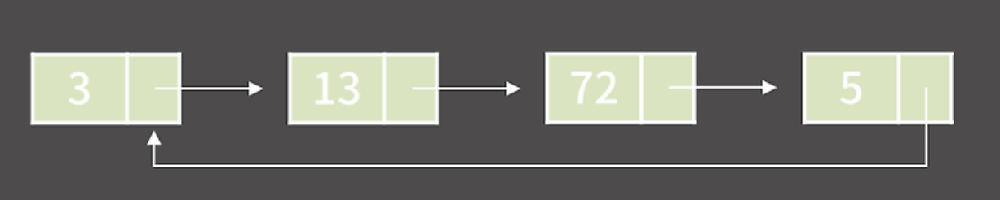

# 연결 리스트(Linked List)

> 원소들을 저장할 때 그 다음 원소가 있는 위치를 포함시키는 방식으로 저장하는 자료구조

### 성질

1. 연속적인 메모리 위치에 저장되지 않는 선형 데이터 구조
2. 각 노드는 데이터 필드와 다음 노드에 대한 참조를 포함하는 노드로 구성

### 특징

1. k번째 원소를 확인/변경하기 위해 `O(k)`가 필요하다.
2. 임의의 위치에 원소를 추가/제거는 `O(1)`
3. 원소들이 메모리 상에 연속해있지 않아 Cache hit rate가 낮지만 할당이 다소 쉬움

### 종류

1. 단일 연결 리스트
   

```
- 각 원소가 자신의 다음 원소의 주소를 들고 있는 연결 리스트
- 주어진 원소의 이전 원소가 무엇인지를 알 수 없음
```

2. 이중 연결 리스트
   

```
- 각 원소가 자신의 이전 원소와 다음 원소의 주소를 둘 다 들고 있음
- 주어진 원소의 이전 원소가 무엇인지 알 수 있음
- 원소가 가지고 있어야 하는 정보가 1개 더 추가되니 메모리를 더 쓴다는 단점이 있음
```

3. 원형 연결 리스트
   

```
- 끝이 처음과 연결되어 있음
- 그림의 예시는 단일 연결 리스트로 표현했지만 이중 연결 리스트로 표현해도 상관 없음
```

### 배열 vs 연결리스트

| 항목                              | 배열 (Array) | 연결 리스트 (Linked List) |
| --------------------------------- | ------------ | ------------------------- |
| k번째 원소의 접근                 | O(1)         | O(k)                      |
| 임의 위치에 원소 추가/제거        | O(N)         | O(1)                      |
| 메모리 상의 배치                  | 연속         | 불연속                    |
| 추가적으로 필요한 공간 (Overhead) | -            | O(N)                      |

#### 레퍼런스

- https://blog.encrypted.gg/932
