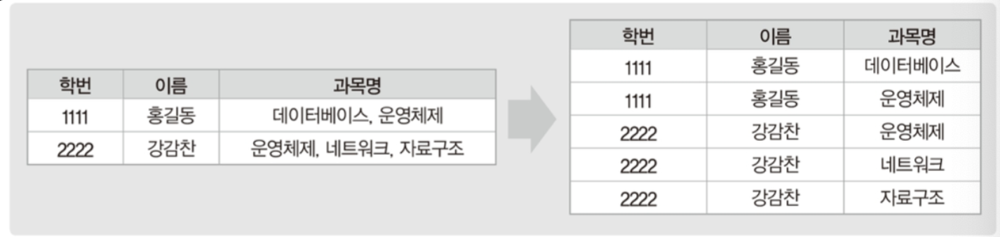
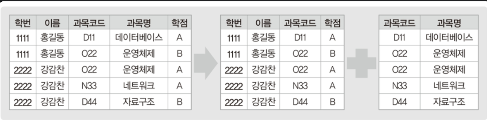
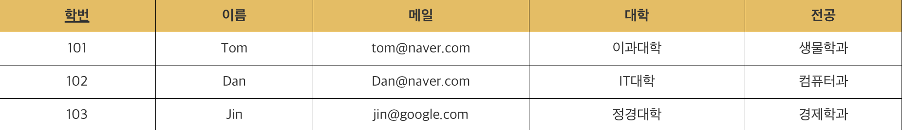
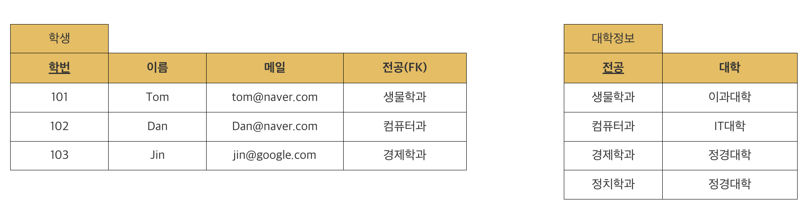

# 정규화(Normalization)

> 데이터의 중복을 줄이고, 무결성을 향상시킬 수 있는 정규화

### Normalization

가장 큰 목표는 테이블 간 중복된 데이터를 허용하지 않는 것
중복된 데이터를 만들지 않으면, 무결성 유지 가능 → DB 저장 용량 또한 효율적으로 관리가능

```
- 도메인 원자값 (1NF)

- 부분적 함수 종속 제거 (2NF)

- 이행적 함수 종속 제거 (3NF)

- 결정자이면서 후보키가 아닌 것 제거 (BCNF)

- 다치 종속 제거 (4NF)

- 조인 종속성 이용 (5NF)
```

### 목적

1. 데이터의 중복을 없애면서 불필요한 데이터를 최소화시킨다.
2. 무결성을 지키고, 이상 현상을 방지한다.
3. 테이블 구성을 논리적이고 직관적으로 할 수 있다.
4. 데이터베이스 구조를 확장에 용이해진다.

### 제 1정규화(1NF)

> 테이블 컬럼이 **원자값(하나의 값)**을 갖도록 테이블을 분리시키는 것을 말한다.

- 어떤 릴레이션에 속한 모든 도메인이 원자값만으로 되어 있어야한다.
- 모든 속성에 반복되는 그룹이 나타나지 않는다.
- 기본키를 사용하여 관련 데이터의 각 집합을 고유하게 식별할 수 있어야 한다.



### 제 2정규화(2NF)

> 테이블의 모든 컬럼이 부분 함수적 종속을 만족해야 한다.

- 아래의 과목코드가 과목 명과 함수 종속관계



### 제 3정규화(3NF)

> 2NF가 진행된 테이블에서 이행적 종속을 없애기 위해 테이블을 분리하는 것이다.

- 이행적 종속 : `A → B`, `B → C`면 `A → C`가 성립된다
- 아래의 대학과 전공의 관계는 이행적 종속의 관계
- ex) 생물학과는 이과대학에 포함, 컴퓨터과는 IT대학에 포함



- 따라서 `학번/이름/메일/전공` - `대학/전공`으로 테이블을 나눠야한다.
- 추가로 테이블의 튜플을 구분하기 위해서 `전공`을 key값으로 가져야함!


