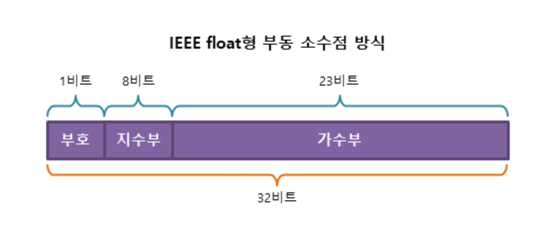

# 💻 고정 소수점 & 부동 소수점

---

***컴퓨터에서 실수를 표현하는 방식은 두 가지이다. '고정 소수점', '부동 소수점'***

## 1. ✅ 고정 소수점
### **소수점이 찍힐 위치를 미리 정해놓고 표현하는 방식(정수 + 소수)**
- 장점 : 실수를 '정수'와 '소수'로 나누어서 표현하여 단순하다.
- 단점 : 표현의 범위가 너무 적어서 활용하기 힘들다. 아래 사진과 같이 정수부는 15, 소수부는 16비트로 제한적
```html
-3.14는 정수부분 : 부호(-), 정수(3), 소수(0.14) 3가지 요소가 필요하다.
```


## 2. ✅ 부동 소수점
### **실수를 가수부 + 실수부로 표현한다**
- 가수부 : 실수의 실제값 표현 
- 실수부 : 크기를 표현한다. 가수의 어디쯤에 소수점이 있는지를 표현한다.
---
- 장점 : 표현할 수 있는 범위가 넓어진다.
- 단점 : 오차가 발생할 수 있다. 

즉, 지수의 값에 따라 소수점이 움직이는 방식을 활용한 실수 표현법이다. -> **소수점의 위치가 고정되어있지 않다.**


---

# 🤔 질문

### 1. 고정 소수점과 부동 소수점의 차이를 설명하시오.
- 표현 범위도 부동 소수점이 더 넓다.
- 소수점의 위치가 고정되어있는지 유무가 다르다.
- 정밀도에 오류가 있다.(부동소수점)

### 2. 부동 소수점을 해결할 수 있는 방법을 한 가지 제시하시오.
```java
if (Math.abs(a-b) == 1e-9) {
    // 두 수는 같다고 하면 부동소수점으로 오류가 날 수 있다.
}
if (Math.abs(a-b) > 1e-9) {
    // 이와 같이 부등호를 사용하여 부동 소수점의 오류를 해결 할 수 있다.
}
```


