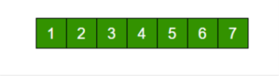

# 💻 배열(Array)

---

## 1. ✅ 자바에서 배열이란?

### ***고정된 크기를 가진 배열***

- 처음에 크기를 선언하고 이후에는 크기를 수정할 수 없다.
- 0부터 시작하는 index로 각 요소에 접근할 수 있다.

**장점**
- 배열의 크기가 정해져있어 메모리 관리가 편하고 효율적이다.
- 크기가 고정되어있어 인덱스를 통해 요소에 직접 접근할 수 있기에 데이터 접근이 쉽다.

**단점**
- 크기가 고정되는 것이 장점일때도 있지만 단점인 경우도 있다. (크기 수정 불가)
- 크기 예측이 어려워서 공간이 남거나 부족할 경우 문제가 발생한다.


## 2. ✅Java 에서의 배열 선언

**배열의 길이가 7인 정적 배열**

```java
import java.util.Arrays;

class Main {
    public static void main(String[] args) {
        int[] arr = new int[5];// 사이즈가 5인 1차원 배열

        arr[0] = 1; // 0번째 인덱스에 1값을지정
        arr[1] = 2; // 1번째 인덱스에 2값을지정
        arr[2] = 3; // 2번째 인덱스에 3값을지정

        Arrays.sort(arr); // 배열을 정렬해준다 (오름차순) Quick 정렬 사용
        
        // int[] arr 로 선언한 배열은 '정적배열' 이다. 
        // 즉 정해진 크기가 정해진 배열로 사이즈가 선언당시 정해지기에 사이즈를 수정할 수 없다.

    }
}
```