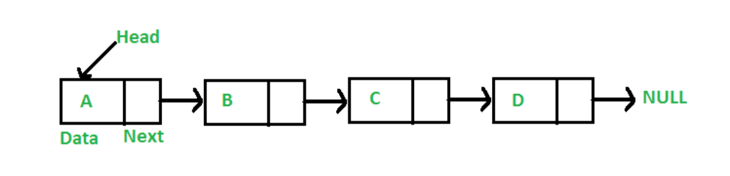

# 💻 연결 리스트(LinkedList)

---

## 1. ✅ 자바에서 리스트란?

**크기가 동적으로 조정되는 배열이다.**

**장점**
- 크기를 동적으로 조정이 가능하기에 추가, 제거가 자유롭다.
- 정적 배열은 크기를 예측하기 어렵지만 동적 배열은 유연하게 관리할 수 있다.
- 삽입, 삭제가 효율적이다.

**단점**
- 오버헤드가 발생할 수 있다. 기존 배열을 삭제하고 복사한다음 그곳에 새로운 삽입, 제거를 진행하기때문에 메모리 관리에 추가적인 오버헤드가 존재한다.
  - 오버헤드가 발생한다는 뜻은 자바는 JVM이라는 메모리를 사용한다. 이때 새로운 배열을 복사해서 메모리에 할당해야하기떄문에 처음부터 메모리를 할당받고 사용하는 정적배열과 다르게 복사할경우 새로운 메모리를 할당받아야한다. 이때 메모리 공간이 부족해서 오버헤드가 발생할 수 있다.
- 동적 배열은 요소의 추가나 삭제에 따라 배열의 재할당과 복사가 필요하므로, 인덱스에 대한 접근시 속도가 상대적으로 느릴 수 있다.

## 2. ✅ Java 에서의 동적 배열 선언

**데이터 필드와 다음 노드에 대한 참조를 포함하는 노드로 구성한다.**


```java
import java.util.*;

class Main {
    public static void main(String[] args) {
        
        List<Integer> arr = new ArrayList<>(); // 배열 타입이 Integer인 List 선언

        arr.add(1);
        arr.add(2);
        arr.add(3);

        System.out.println(arr.size()); // 사이즈는 3

    }
}
```

