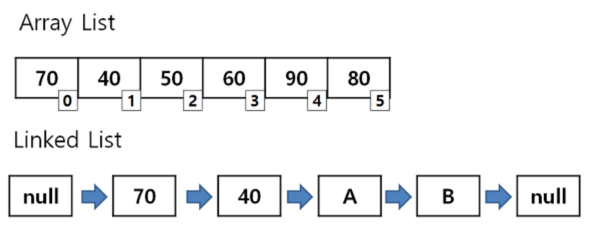

# 💻 Array & ArrayList & LinkedList

---


### Array : index로 빠르게 값을 찾는 것이 가능하다.
### LinkedList는 데이터의 삽입 삭제가 빠르다.
### ArrayList는 데이터를 찾는데 빠르지만, 삽입 및 삭제가 느리다.

## 1. ✅ Array

- ***배열(Array)는 선언할 때 크기와 데이터 타입을 지정해야 한다.***
```java
int arr[10];
String arr[5];
```

즉, 배열(Array)는 메모리 공간에 할당할 사이즈를 미리 정해놓고 사용하는 자료구조다.

- 계속 데이터가 늘어날 때, 최대 사이즈를 알 수 없을 때는 부적합하다.
- 중간에 데이터를 삽입하거나 삭제할 때도 매우 비효율적이다.
    - 4번째 index 값에 새로운 값을 넣을때 -> 원래 값을 뒤로 밀어내고 해당 index에 덮어씌운다. -> 부적합한 점이 많다.
    - 그러나, index가 존재하기에 위치를 바로 알 수 있어 검색에 편한 장점이 있다.

## 2. ✅ List

배열(Array)의 단점을 해결하기 위해 나온 것이 List

- List는 Array처럼 크기를 정해주지 않아도 된다. 대신 array에서 index가 중요했다면 List에서는 순서가 중요하다.
- 크기가 정해져있지 않기 때문에, 중간에 데이터를 추가, 삭제 하더라도 배열에서 갖고 있던 문제점을 해결 가능하다. 
  - index를 가지고 있으므로 검색도 빠르다.
  - 하지만, 중간에 데이터를 추가 및 삭제 할 때 시간이 오래걸린다. (메모리 낭비, 연산 추가)..

## 3. ✅ LinkedList

- 연결 리스트에는 단일, 다중 등 여러가지가 존재한다.
  - 단일노드는 앞 노드만 가리키고, 다중은 앞뒤 노드를 모두 가리키는 차이
- 그러나, 종류가 무엇이든, **한 노드에 연결될 노드의 포인터 위치를 가리키는 방식**으로 되어있다.
- 당연히 생각해보면 삽입, 삭제가 빠를 것이다. 왜? 전체를 돌지 않아도 이전 값과 다음 값이 가르켰던 주소값만 수정하여 연결시켜주면 되기 때문이다! 우와!
    - 하지만, List의 K번째 값을 찾아라 에서는 비효율 적이다. 
    - array, arrayList에서 index를 갖고 있기에 서치가 빠르다, LinkedList는 처음부터 살펴봐야 하므로 검색에 있어서는 시간이 더 걸린다는 단점이 존재한다.

---

# 🤔 질문

### 1. ArrayList vs LinkedList의 장단점에 대해서 설명해주세요.

- ArrayList는 index가 존재하기에 검색이 빠르다, 그치만 삽입 삭제가 오래 걸린다.
- LinkedList는 삽입, 삭제시 가르켰던 노드를 찾아서 추가해주거나 삭제하면 되기에 빠르다, 그치만 index가 존재하지 않기에 검색이 느리다.

