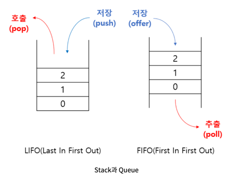
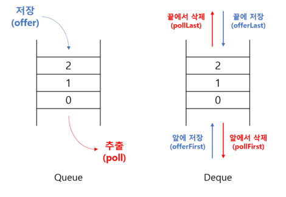
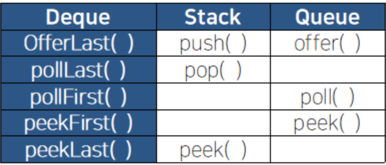

# 💻 스택 & 큐

---



## 1. ✅ 스택

***입력과 출력이 한 곳(방향)으로 제한***
### LIFO (Last In First Out, 후입선출) : 마지막 삽입이 가장 먼저 출력

- java에서의 stack 명령어

```java
import java.util.Stack;

public static void main(String[] args) {
    Stack<Integer> stack = new Stack<>();
    stack.empty(); // 비어있는지 체크
    
    stack.add(); // 스택에 아이템 추가 성공하면 true반환 저장공간 없으면 에러 발생
    stack.push(); // 스택에 아이템 추가 
    
    stack.peek(); // 스택에서 맨 위에 저장된 객체 반환 (꺼내진 않고 반환만 함)
    stack.pop(); // 스택에서 맨 위에 저장된 객체 반환 (값을 꺼내고 반환 함)
    stack.search(o);    // 스택에 주어진 객체 o를 찾아서 위치를 반환 (없을시 -1 반환, 배열과 달리 위치가 1부터 시작)
}

```

## 2. ✅ 큐

***입력과 출력을 한 쪽 끝(front, rear)으로 제한***
### FIFO (First In First Out, 선입선출) : 먼저 삽입된 것이 가장 먼저 출력

- java에서의 queue 명령어

```java

import java.util.LinkedList;
import java.util.Queue;

public static void main(String[] args) {
    Queue<Integer> q = new LinkedList<>();

    q.isEmpty(); // 비어있는지 확인 boolean
    
    q.add(); // 아이템 삽입 성공시 true 공간이 없을시 에러 발생
    q.offer(); // 성공하면 true 실패시 false 반환
    
    q.poll(); // 꺼내서 반환 없을시 null 반환
    q.remove(); // 꺼내서 반환 없을시 에러 반환
    q.peek(); // 값을 보여주기만 함 꺼내지 않음 없을시 null 반환
    q.element(); // 값을 보여주기만함 꺼내지 않음 없을시 에러 반환
    
    
    // js 에는 shift -> 빼는 함수다 -> O(n)
    // 5 4 3 2 1  -> 1 
}
```

## 3. ✅ Deque(Double-Ended Queue)
    


- Queue의 변형으로, 한쪽 끝으로만 추가/삭제 할 수 있는 Queue와 달리 Deque는 양쪽 끝에서 추가/삭제가 가능하다.
- Deque는 Queue가 조상이며 구현체로는 ArrayDeque, LinkedList등이 있다.

- Deque는 Stack과 Queue를 하나로 합쳐놓은 것과 같아서 Stack, Queue 둘다 사용 가능하다.

## ✏️ 문제 : 프로그래머스 '기능개발'

```java
import java.io.*;
import java.util.*;

public class Solution {

    public static void main(String[] args) {

        int[] progresses = {93, 30, 55};
        int[] speeds = {1, 30, 5};

        System.out.println(Arrays.toString(solution(progresses, speeds)));

    }

    public static int[] solution(int[] progresses, int[] speeds) {

        Queue<Integer> progressQ = new LinkedList<>();
        Queue<Integer> speedQ = new LinkedList<>();
        List<Integer> dayCountList = new ArrayList<>();

        for (int progress : progresses) {
            progressQ.add(progress);
        }

        for (int speed : speeds) {
            speedQ.add(speed);
        }

        while (!progressQ.isEmpty()) {

            int tempProgress = progressQ.poll(); // 93
            int tempSpeed = speedQ.poll(); // 1

            int dayCount = 0;

            for (int i = tempProgress; i < 100; i += tempSpeed) {
                dayCount++;
            }

            dayCountList.add(dayCount);

        }

        int answerCount = 1;
        List<Integer> answerList = new ArrayList<>();
        int standard = dayCountList.get(0);
        for (int i = 1; i < dayCountList.size(); i++) {
            if (dayCountList.get(i) <= standard) {
                answerCount++;
            } else {
                answerList.add(answerCount);
                standard = dayCountList.get(i);
                answerCount = 1;
            }
        }
        
        answerList.add(answerCount);


        int[] answer = new int[answerList.size()];
        for(int i = 0 ; i < answerList.size(); i++ ) {
            answer[i] = answerList.get(i);
        }

        return answer;

    }
}

```

---

# 🤔 질문

### 1. 스택과 큐는 데이터 꺼낼때 어떤 구조를 갖는가?

- 스택(LIFO), 큐(FIFO)

### 2. Deque에 대해서 간단하게 설명해주세요

- Double-Ended Queue라는 이름처럼 양쪽에서 추가/삭제가 가능하다.


