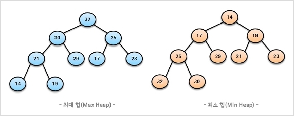

# 💻 힙(Heap)

---

**완전 이진 트리의 일종**
- 여러 값 중, 최대값고 최소값을 빠르게 찾아내도록 만들어진 자료구조
- 힙 트리는 중복된 값 허용(이진 탐색 트리는 중복값 허용X)

## 1. ✅ 힙 종류
- 최대 힙
  - 부모 노드의 키 값이 자식 노드의 키 값보다 크거나 같은 완전 이진 트리
- 최소 힙
  - 부모 노드의 키 값이 자식 노드의 키 값보다 작거나 같은 완전 이진 트리


## 2. ✅ 힙 사용

### 힙 구현
- 힙을 저장하는 표준적인 자료구조는 '배열'
- 구현을 쉽게 하기 위해 배열의 첫번째 인덱스 0은 사용되지 않음
- 특정 위치의 노드 번호는 새로운 노드가 추가되어도  변하지 않음 -> 루트 노드(1)의 오른쪽 노드 번호는 항상 3
```
부모 노드와 자식 노드 관계

왼쪽 자식 index = (부모 index) * 2

오른쪽 자식 index = (부모 index) * 2 + 1

부모 index = (자식 index) / 2
```


### 힙 삽입
- 힙에 새로운 요소가 들어오면, 일단 새로운 노드를 힙의 마지막 노드에 삽입
- 새로운 노드를 부모 노드들과 교환

### 힙 삭제
- 최대 힙에서 최대 값은 루트 노드이므로 루트 노드가 삭제됨 (최대 힙에서 삭제 연산은 최대값 요소를 삭제하는 것)
- 삭제된 루트 노드에는 힙의 마지막 노드를 가져옴 
- 힙을 재구성

## 3. ✅ 우선순위 큐
- 왜? 우선순위 큐가 힙에서 나오는가? -> 힙은 우선순위 큐를 위해 만들어진 자료 구조다.
- 힙은 반 정렬 상태이다. 여러 값중 최대, 최소값을 찾기 위해 만들어졌기 때문

***우선순위 큐란? -> 우선순위의 개념을 큐에 도입한 자료구조***
- 데이터들이 우선순위를 가지고 있음. 우선순위가 높은 데이터가 먼저 나간다. (스택은 LIFO, 큐는 FIFO)

- 우선순위 큐는 배열, 연결리스트, 힙으로 구현 (힙이 가장 효율적)
  - 삽입 : O(logn), 삭제 : O(logn)

- 힙 삽입, 삭제 예제 코드 (우선순위 큐, 최대 힙)
```java
import java.util.*;

public class Practice {
    public static void main(String[] args) {
        
        // 최대 힙 생성
        PriorityQueue<Integer> maxHeap = new PriorityQueue<>(Collections.reverseOrder());  // 내림 차순으로 바꿔서 최대 힙처 만든 것
        
        maxHeap.add(10);
        maxHeap.add(5);
        maxHeap.add(20);
        maxHeap.add(1);

        // 20
        System.out.println("Max Heap (삽입 후): " + maxHeap);

        // 20
        System.out.println("Max Heap 삭제된 값: " + maxHeap.poll());
        
        // 10
        System.out.println("Max Heap 삭제된 이후 최대 값: " + maxHeap);
    
    }
}
```

---

# 🤔 질문

### 1. 우선순위 큐의 삽입, 삭제 시간 복잡도는?

- 삽입, 삭제 둘다 O(logN)이다.  

### 2. 힙은 어떤 자료구조의 일종인가?

-  완전 이진 트리의 일종이다. 완전 이진 트리란 자식 노드가 최대 두 개 까지만을 가진 것을 뜻한다.

### 3. 힙의 부모노드와 자식노드의 관계 그리고 부모 index를 구하는 식이 어떻게 되는가?

- 왼쪽 자식 index = (부모 index) * 2
- 오른쪽 자식 index = (부모 index) * 2 + 1
- 부모 index = (자식 index) / 2
