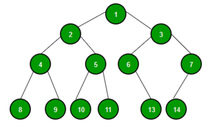
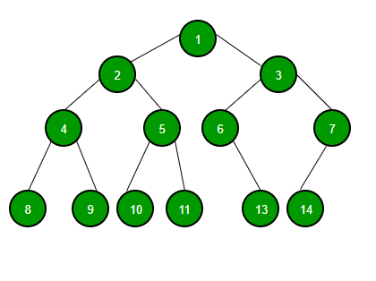

# 💻 트리(Tree)

---

***노드와 엣지로 이루어진 자료구조***



## 1. ✅ 트리란?

- **트리란 값을 가진 Node와 이 노드를 이어주는 간선(Edge)으로 이루어져 있다.**
- 위 그림상 데이터 1을 가진 노드가 루트 노드이다.
- 모든 노드들은 0개 이상의 자식 노드를 갖고 있으며 보통 부모-자식 관계로 부른다.
- 트리는 비 선형 구조이다.
- 트리는 몇 가지 특징이 있다.
  - 트리에는 사이클이 존재할 수 없다. (만약 사이클이 존재한다면, 그것은 트리가 아닌 그래프이다.)
  - 모든 노드는 자료형으로 표현이 가능하다.
  - 루트에서 한 노드로 가는 경로는 유일한 경로 뿐이다.
  - 노드의 개수가 N개면, 간선은 N-1개를 가진다.

## 2. ✅ 트리 순회 방식



### 1) 전위 순회

- Root -> 왼쪽 자식 -> 오른쪽 자식
- 1 -> 2 -> 4 -> 8 -> 9 -> 5 -> 10 -> 11 -> 3 -> 6 -> 13 -> 7 -> 14

### 2) 중위 순회

- 왼쪽 자식 -> Root -> 오른쪽 자식
- 8 -> 4 -> 9 -> 2 -> 10 -> 5 -> 11 -> 1 -> 13-> 6 -> 3 -> 14 -> 7

### 3) 후위 순회

- 왼쪽 자식 -> 오른쪽 자식 -> Root
- 8 -> 9 -> 4 -> 10 -> 11 -> 5 -> 2 -> 13 -> 6 -> 14-> 7 -> 3 -> 1

### 4) 레벨 순회

- Root부터 계층 별로 방문하는 방식
- 1 -> 2 -> 3 -> 4 -> 5 -> 6 -> 7 -> 8 -> 9 -> 10 -> 11 -> 12 -> 13 -> 14

## ✏️ 문제 : 백준 ''
```java

```


# 🤔 질문

### 1. 트리의 특징에 대해서 아는대로 설명해주세요.

- 트리에는 사이클이 존재할 수 없다 -> 존재한다면 그래프
- 모든 노드는 자료형으로 표현 가능하다.
- 루트에서 다른 노드로 가는 경로는 유일한 경로 뿐이다.
- 노드의 개수가 N개면, 간선은 N-1개를 가진다.

### 2. 트리를 순회하는 방식은?

- 전위 순회, 중위 순회, 후위 순회, 레벨 순회
- 전위 순회는 뿌리 -> 왼 -> 오
- 중위 순회는 왼 -> 뿌리 -> 오
- 후위 순회는 왼 -> 오 -> 뿌리
- 레벨 순회는 계층별로 왼 -> 오 
