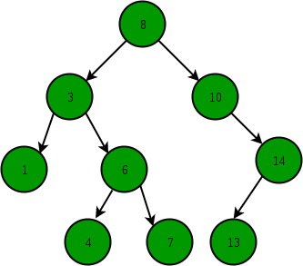

# 💻 이진 탐색 트리

---

***각 노드가 최대 두 개의 자식 노드를 갖는 구조이다.***
- 왼쪽 서브 트리에는 **현재 노드보다 작은 값만 존재**
- 오른쪽 서브 트리에는 **현재 노드보다 큰 값만 존재**
- 각각의 서브 트리도 모두 이진 탐색 트리여야 한다.
- 중복된 노드가 없어야 한다.

## 1. ✅ 이진 탐색 트리의 목적?

***이진탐색 + 연결리스트***

- 이진탐색 : 탐색에 소요되는 시간 복잡도는 O(logN), but 삽입, 삭제가 불가능
- 연결리스트 : 삽입, 삭제의 시간 복잡도는 O(1), but 탐색하는 시간 복잡도가 O(N)

 위 두가지를 합하여 장점을 얻는 것이 '이진탐색트리'

즉, 효율적인 탐색 능력을 가지고, 자료의 삽입 삭제도 가능하게 만드는 것

## 2. ✅ 이진 탐색 트리의 특징

- 이진 탐색 트리의 순회는 '중위순회' 방식, 중위 순회로 정렬된 순서를 읽을 수 있음

### 이진 탐색 트리 핵심연산
- 검색
- 삽입
- 삭제
- 트리 생성
- 트리 삭제

### 시간 복잡도
- 균등 트리 : 노드 개수가 N개 일때 O(logN)
- 편향 트리 : 노드 개수가 N개 일때 O(N) -> 최악의 경우 예를들어 1,2,3,4,5,6.. 일 경우 다 편향되어있다.

### 삭제의 3가지 Case
- 자식이 없는 leaf 노드일 때 -> 그냥 삭제
- 자식이 1개인 노드일 때 -> 지워진 노드에 자식을 올리기
- 자식이 2개인 노드일 때 -> 오른쪽 자식 노드에서 가장 작은 값 or 왼쪽 자식 노드에서 가장 큰 값 올리기 

- 편향된 트리는 사용할 이유가 없다 이를 개선하는 트리가 -> AVL Tree, RedBlack Tree

## ✏️ 문제 :  ''

---

# 🤔 질문

### 1. 이진 탐색 트리의 최악의 시간 복잡도는 언제이고 어떤가요?

- 편향된 트리일 경우 최악이고 O(N) 입니다.

### 2. 이진 탐색 트리란 무엇인가요?

- 왼쪽 서브 트리에는 작은값, 오른쪽 서브 트리에는 큰값만 각각의 서브 트리도 모두 같은 상황에 중복도 없는 자식 노드가 최대 두개인 트리이다.
- 검색, 삽입, 삭제, 트리생성, 트리삭제에 특화되어있다.

