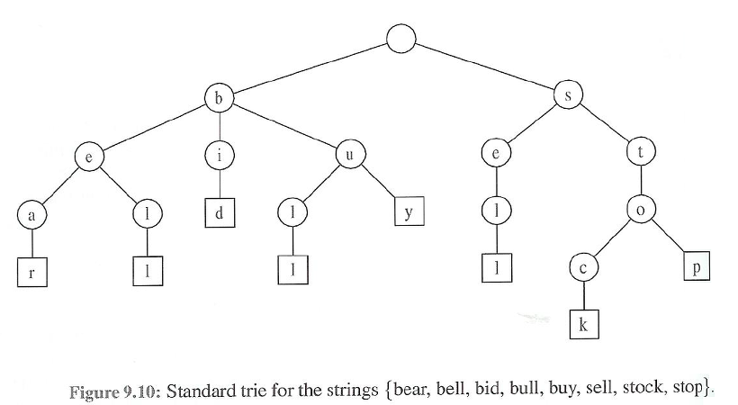

# 💻 트라이(Trie)

---

## 1. ✅ 트라이란?



***문자열에서 검색을 빠르게 도와주는 자료구조***

```
정수형에서 이진탐색트리를 이용할때 시간복잡도 -> O(logN)
but, 문자열에서 적용했을 때, 문자열 최대 길이가 M이면 O(M*logN)이 된다.

트라이를 할용하면 -> O(M)으로 문자열 검색이 가능하다.
```

## ✏️ 문제 :  ''

---

# 🤔 질문

### 1. 트라이의 시간복잡도는?

- 문자열의 길이가 M일떄 O(M)이다.

