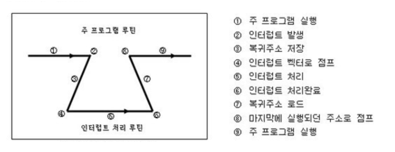

# 💻 인터럽트

---

> 프로그램 실행중 예기치 않은 오류가 발생하여 현재 실행중인 프로그램을 종료시키고 발생된 상황을 즉시 처리해줘야한다고 CPU에게 알리는 것

## 1. ✅ 인터럽트 종류

**외부/내부 인터럽트**
- CPU의 하드웨어 신호에 의해 발생
  - 외부 인터럽트 : 입출력 장치, 타이밍 장치, 전원 등 외부적인 요소로 발생한다.
    - ex) 전원 이상, 기계 착오, 외부 신호, 입출력..
  - 내부 인터럽트 : Trap이라고 부르며, 잘못된 명령어에 의해서 발생된다.
    - ex) 0으로 나누기 발생, 오버플로우, 명령어를 잘못사용한 경우 (Exception)

**소프트웨어 인터럽트**
- 명령어의 수행에 의해서 발생
  - 사용자가 프로그램을 실행시킬 때 발생한다. 소프트웨어 이용 중에 다른 프로세스를 실행시키면 시분할 처리를 위해 자원 할당 동작이 수행된다.

## 2. ✅ 인터럽트 발생 처리과정

1. 주 프로그램을 실행
2. 인터럽트 발생 -> 이벤트 발생
3. 복귀주소 저장 -> 전에 작업 하던 주소 저장
4. 인터럽트 벡터로 점프  ---ㅣ
5. 인터럽트 처리     -----------   ㅣ
6. 처리 완료        -----------------ㅣ 
7. 복귀 주소 로드
8. 마지막에 실행되던 주소로 점프
9. 주 프로그램 실행 

- **만약 인터럽트가 없다면?**
  - 특정한 어떤 일을 할 시기를 계속 체크해야한다. -> 이를 폴링이라고 한다.
  - 폴링은 원래 하던 일을 제대로 할 수 없다는 단점이 있다.

### 폴링 방식

- 사용자가 명령어를 이용해 핀의 값을 계속 읽어내는 방식
- 인터럽트 요청 플래그를 순차적으로 탐색하여 높은 순위의 인터럽트부터 순차적으로 처리한다. 이에 맞는 서비스 루틴을 실행 (하드웨어에 비해 속도가 느리다.)

### 인터럽트 방식

- MCU 자체가 하드웨어적 변화를 체크해서 변화시에만 일정한 동작을 하는 방
  - Daisy Chain
  - 병렬 우선순위 부여

> 인터럽트 방식은 하드웨어로부터 지원을 받아야하는 제약 조건이 있지만, 폴링에 비해 신속하게 대응이 가능하다. 따라서 실시간 대응이 필요할때는 필수적이다.
> 
> **즉, 인터럽트는 발생시기를 예측하기 힘든 경우 컨트롤러가 가장 빠르게 대응할 수 있는 방식이다.**

---

# 🤔 질문

### 1. 인터럽트 종류에 대해서 설명하시오

- CPU의 하드웨어 신호에 의해 발생하는 내부, 외부 인터럽트와 명령여의 수행에 의해서 발생하는 소프트웨어 인터럽트가 있다.

### 2. 인터럽트 발생 처리과정에 대해서 설명하시오.
- 주 프로그램 실행 -> 인터럽트 발생 -> 복귀주소 저장해두고 -> 인터럽트 백터로 점프 -> 처리 -> 처리완료 -> 주소로드 -> 마지막에 실행되던 주소로 점프 -> 주프로그램 실행

