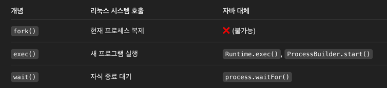

# 💻 시스템 콜

---

> fork, exec, wait는 Process의 제어와 생성을 위한 SystemCall
> 
> fork, exec은 Process 생성과 관련이 있다.
> 
> wait는 Process(Parent)가 만든 다른 Process(child)가 끝날떄까지 기다리는 명령어이다.
> 

- 자바에서는 위 명령어가 모두 존재하지 않는다. 자바언어에서 다뤄보겠다.

## 1. ✅ Exec, Wait

```java
ProcessBuilder processBuilder = new ProcessBuilder("ls", "-al");
Process process = processBuilder.start(); // exec
int exitCode = process.waitFor(); // wait
```

- Fork는 직접 지원하지 않는다.  즉 자바에서는 fork-exec-wait패턴은 ProcessBuilder나 Runtime을 이용해 외부 프로세스를 실행하고 종료를 기다리는 식으로 구현할 수 있다.


# 🤔 질문


