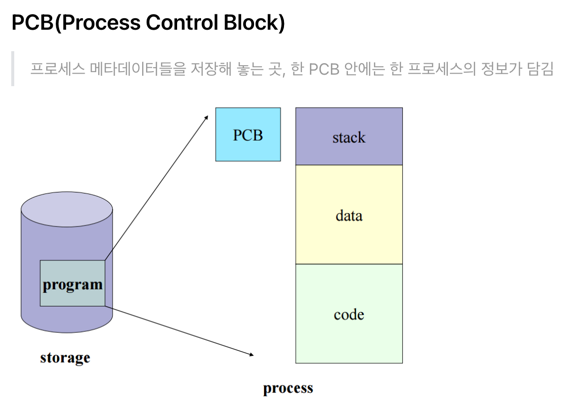

# 💻 PCB & ContextSwitching

---

## 1. ✅ Process Management

> CPU가 프로세스가 여러개일때, CPU 스케줄링을 통해 관리하는것을 말한다.

- 이때 CPU는 각 프로세스들이 누군지 알아야 관리가 가능하다. 이 특징을 갖고있는게 Process Metadata

- ProcessMetadata
    - ProcessID
    - Process State
    - Process Priority
    - CPU Registers
    - Owner
    - CPU Usage
    - Memory Usage

- 이 메타 데이터는 프로세스가 생성될 떄 PCB에 저장됩니다.

## 2. ✅ PCB (Process Control Block)

- PCB가 왜 필요한가?
> CPU에서는 프로세스의 상태에 따라 교체 작업이 이루어진다. 이때 앞으로 수행할 대기중인 프로세스에 관한 값을 PCB에 저장해두는것이다.

- PCB는 어떻게 관리되는가?
> LinkedList 방식으로 관리된다. PCB List Head에 PCB가 생성될떄마다 주소값이 헤드에 붙고 PCB가 실행되면 삭제된다, 링크드 리스트라서 삭제, 삽입이 용이하다!

## 3. ✅ Context Switching

- 위처럼 수행중인 프로세스가 실행될떄, CPU의 레지스터 정보가 변경되는것이 Context Switching 이다.

> CPU가 이전의 프로세스 상태를 PCB에 저장하고, 또다른 프로세스의 정보를 PCB에서 읽어 레지스터에 등록하는 과정
>
> 보통 인터럽트가 발생, 실행중인 CPU 사용 허가시간을 모두 사용하거나, 입출력을 위해 대기해야하는 경우에 Context Swtiching이 일어난다.

- Context Switching 의 OverHead란?
> 프로세스를 수행하다가 입출력 이벤트가 발생하여 대기 상태로 전환시킨다. 이때, CPU를 놀게 시키는것보다 다른 일을 시키는 것이 더 효율적이다.

---

# 🤔 질문

### 1. Process Mangement에 대해서 설명해주세요
- CPU가 프로세스가 여러개일떄 CPU 스케줄링을 통해 관리하는 것을 말한다~!

### 2. Context Switching OverHead 설명해주시오.
- 프로세스 실행하다가 입출력이 발생해서 혹은 다른 PCB에서 프로세스를 읽어 레지스터에 적제하는 상황이 올때 CPU가 놀지 않도록 다른 일을 시켜 효율을 높이는 것

### 3. PCB는 어떤 자료구조 형식으로 저장, 삭제가 되나요?
- 링크드리스트 형식으로 저장 삭제되며, 사용되면 삭제되고 생기면 PCB List Head에 PCB가 생성될때마다 주소값이 헤드에 붙는다.

