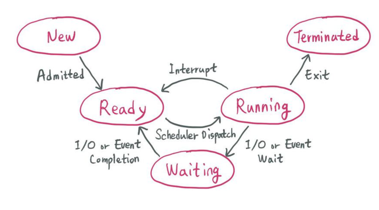
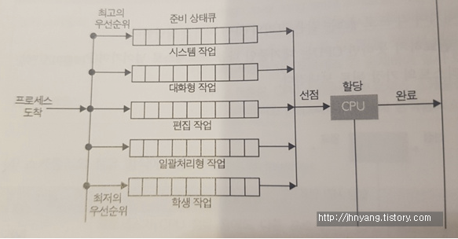
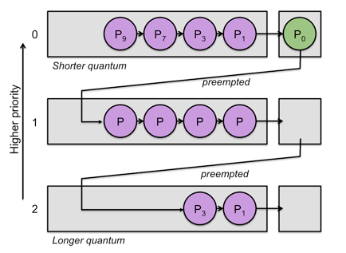

# 💻 CPU 스케줄링

---

> 스케줄링이란, CPU를 잘 사용하기 위해 프로세스를 잘 배정하는 것을 뜻한다.
> 
> 조건 : 오버헤드 낮고, 사용률 높고, 기아현상을 낮을때
> 
> 목표 
> 
> 1. Batch System : 가능하면 많은 일을 수행. 시간 보단 처리량이 중요하다. 시간 < 처리량
> 2. Interactive System : 빠른 응답 시간. 적은 대기 시작
> 3. Real-time System : 기한 맞추기

## 1. ✅ 선점 / 비선점 스케줄링

- 선점 : OS가 CPU의 사용권을 선점할 수 있는 경우, 강제 회수하는 경우 (처리시간 예측 어렵다.)
- 비선점 : 프로세스 종료 || I/O 등의 이벤트가 있을 때까지 실행 보장 (처리시간 예측 용이하다.)

## 2. ✅ 프로세스 상태 

위 사진 기준
- 선점 스케줄링 : Interrupt, I/O || Event Completion, I/O || Event Wait, Exit
- 비선점 스케줄링 : I/O || Event Wait, Exit

---

**프로세스의 상태 전이**

- 승인 : 프로세스 생성이 가능하여 승인된다. -> 프로세스 승인하는거임
- 스케줄러 디스패치 : 준비상태에 있는 프로세스 중 하나를 선택하여 실행시키는 것 -> 준비중 하나 갖고가기
- 인터럽트 : 예외, 입출력, 이벤트 등이 발생하여 현재 실행중인 프로세스를 준비 상태로 바꾸고, 해당 작업을 먼저 처리하는 것 -> 예외인거 준비로 바꿔서 먼저처리
- 입출력 또는 이벤트 대기 : 실행 중인 프로세스가 입출력이나 이벤트를 처리해야 하는 경우, 입출력/이벤트가 모두 끝날 때까지 대기 상태로 만드는 것 -> 이벤트나 입출력할때 모두 끝날떄까지 달리고있는거 기다리게 시키기
- 입출력 또는 이벤트 완료 : 입출력/이벤트가 끝난 프로세스를 준비 상태로 전환하여 스케줄러에 의해 선택될 수 있도록 만드는 것 -> 다끝났으면 준비상태로 대기.

## 3. ✅ CPU 스케줄링의 종류

- 비선점 스케줄링
  - FCFS(First Come First Served)
    - 큐에 도착한 순서대로 CPU 할당
    - 실행 시간이 짧은 게 뒤로 가면 평균 대기 시간이 길어진다.
  - SJF(Shortest Job First)
    - 수행시간이 가장 짧다고 판단되는 작업 먼저 수행
    - FCFS 보다 평균 대기 시간이 감소, 짧은 작업에 유리
  - HRN(Highest Response-ratio Next)
    - 우선순위를 계산하여 점유 불평등을 보완한 방법 (SJF의 단점 보완)
    - 우선순위 = (대기시간 + 실행시간) / (실행시간)
- 선점 스케줄링
  - Priority Scheduling
    - 정적/동적으로 우선순위를 부여하여 우선순위가 높은 순서대로 처리
    - 우선 순위가 낮은 프로세스가 무한정 기다리는 Starvation 이 생길 수 있다.
    - Aging 방법으로 Starvation 문제 해결 가능하다.
  - 라운드 로빈
    - FCFS에 의해 프로세스들이 보내지면 각 프로세스는 동일한 시간 Time Quantum 만큼 CPU를 할당 받는다.
      - Time Quantum or Time Slice : 실행의 최소 단위 시간
    - 할당 시간(Time Quantum)이 크면 FCFS와 같게 되고, 작으면 Context Switching 이 잦아져서 오버헤드가 증가한다.
  - Multilevel-Queue(다단계 큐)
    - 작업들을 여럴 종류의 그룹으로 나누어 여러 개의 큐를 이용하는 기법
    - 
    - 우선순위가 낮은 큐들이 실행 못하는 걸 방지하고자 각 큐마다 다른 Time Quantum을 설정 해주는 방식 사용한다.
    - 우선순위가 높은 큐는 작은 Time Quantum 할당. 우선순위가 낮은 큐는 큰 Time Quantum 할당.
  - Multilevel-Feedback-Queue(다단계 피드백 큐)
    - 
    - 다단계 큐에서 자신의 Time Quantum을 다 채운 프로세스는 밑으로 내려가고 자신의 Time Quantum을 다 채우지 못한 프로세스는 원래 큐 그대로
      - Time Quantum을 다 채운 프로세스는 CPU burst 프로세스로 판단하기 대문
    - 짧은 작업에 유리, 입출력 위주(인터럽트가 잦은) 작업에 우선권을 준다.
    - 처리 시간이 짧은 프로세스를 먼저 처리하기 때문에 Turnaround 평균 시간을 줄여준다.

## 4. ✅ CPU 스케줄링 척도

- Response Time : 작업이 처음 실행되기까지 걸린 시간
- Turnaround Time : 실행 시간과 대기 시간을 모두 합한 시간으로 작업이 완료될 때 까지 걸린 시간

---

# 🤔 질문

### 1. 스케줄링이란?

- CPU를 잘 사용하기 위해 프로세스를 잘 배정하는 것

### 2. 스케줄링중 선점/비선점에 대해서 설명해주세요

- 선점 : OS가 CPU의 사용권을 선점할 수 있는 경우, 강제 회수할 수 있는 경우
- 비선점 : 프로세스 종료, I/O 등의 이벤트가 있을 때까지 실행 보장한다.

### 3. 선점/비선점 스케줄링 종류 질문 많이해볼겡

