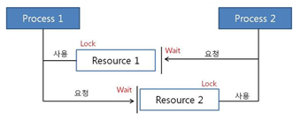

# 💻 데드락 (DeadLock, 교착 상태)

---
> 두 개 이상의 프로세스나 스레드가 자원을 못얻어서 다음 처리 못할때
> 
> 무한히 다음 자원을 기다리게되는 상황을 뜻한다, 시스템적으로 한정된 자원을 여러 곳에서 사용할때 발생!

## 1. ✅ 데드락 발생

- 위 사진처럼 프로세스 1, 2가 자원 1,2를 얻는다고 생각해보자.
사진을 보면 서로 원하는 자원이 상대방에게 할당 되어 있기에 두 프로세스는 무한정 wait 상태에 빠진다. -> 데드락!

- 주로 멀티 프로그래밍 환경에서 한정된 자원을 얻기 위해 서로 경쟁하는 상황에서 발생한다. 자원이 요청했는데 그리고 그 자원이 사용못할때 발생하는데 대기상태로 돌아가겠죠? -> 그러면 대기상태인 프로세스는 실행 상태로 변경 못한다 계속 '교착상태'

## 2. ✅ 데드락 발생 조건

> 4가지 모두 성립 해야지 데드락이 발생한다. 하나라도 성립 안하면 데드락 발생 안함~ 해결가능!
 
- 상호 배제 : 자원은 한번에 한 프로세스만 사용할 수 있다.
- 점유 대기 : 최소한 하나의 자원을 점유하고 있으면서 다른 프로세스에 할당되어 사용하고 있는 자원을 추가로 점유하기 위해 대기하는 프로세스가 존재해야 한다.
- 비선점 : 다른 프로세스에 할당된 자원은 사용이 끝낼 때까지 빼앗을 수 없다.
- 순환 대기 : 프로세스의 집합에서 순환 형태로 자원을 대기하고 있어야 한다.

## 3. ✅ 데드락 처리

### 예방

- 교착 상태 발생 조건 중 하나를 해결하면서 해결한다. -> 자원낭비 심하다
> - 상호배제 부정 : 여러 프로세스가 공유 자원 사용
> - 점유대기 부정 : 프로세스 실행전 모든 자원을 할당한다.
> - 비선점 부정 : 자원 점유 중인 프로세스가 다른 자원을 요구할 때 가진 자원을 반납한다.
> - 순환대기 부정 : 자원에 고유번호 할당 후 순서대로 자원 요구한다.

### 회피
- 교착 상태 발생 시 피해나가는 방법
> 은행원 알고리즘
>
> - 은행에서 모든 고객의 요구가 충족되도록 현금을 할당하는 데서 유래했다.
> - 프로세스가 자원을 요구할 때, 시스템은 자원을 할당한 후에도 안정 상태로 남아있게 되는지 사전에 검사해서 교착 상태를 회피한다.
> - 안정 상태면 자원 할당, 아니면 다른 프로세스들이 자원 해지까지 대기한다.

- 교착 상태가 되도록 허용한 다음 회복시키는 방법 
### 탐지
- 자원 할당 그래프를 통해 교착 상태를 탐지한다.
- 자원 요청시, 탐지 알고리즘을 실행시켜 그에 대한 오버헤드 발생함
### 회복
- 교착 상태 일으킨 프로세스를 종료하거나, 할당된 자원을 해제시켜 회복시키는 방법
> 프로세스 종료 방법
> - 교착 상태의 프로세스를 모두 중지
> - 교착 상태가 제거될 때까지 하나씩 프로셋 ㅡ중지
> 
> 자원 선점 방법
> - 교착 상태의 프로세스가 점유하고 있는 자원을 선점해 다른 프로세스에게 할당 (해당 프로세스 일시정지 시킴)
> - 우선 순위가 낮은 프로세스나 수행 횟수 적은 프로세스 위주로 프로세스 자원 선점

---

# 🤔 질문

### 1. 데드락이 뭔가요?

- 두 개 이상의 프로세스나 스레드가 자원을 못얻는 상태 그래서 계속 대기해서 실행상태가 안되는 상태

### 2. 발생 조건 4가지를 말하시오

- 상호 배제, 점유 대기, 비선점, 순환 대기

### 3. 데드락 처리 '회복'에 대해서 설명해주세요

- 프로세스를 모두 종료시키거나 (교착상태를 일으킨), 할당된 자원을 해제시켜서 회복시키는 방법

