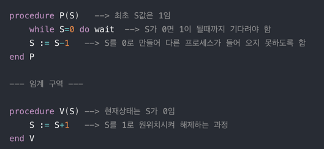

# 💻 세마포어 & 뮤텍스

---

> 경쟁상태를 공부했다면 공유자원에 여러 프로세스가 동시에 접근하면 문제가 발생하는걸 알 수 있다.
> 
> 이때 공유된 자원의 데이터는 한 번에 하나의 프로세스만 접근할 수 있도록 제한을 둬야 한다. -> 이를 위해 나온게 '세마포어'
> 
> 세마포어 : 멀티프로그래밍 환경에서 공유 자원에 대한 접근을 제한하는 방법 

## 1. ✅ 임계 구역

- 여러 프로세스가 데이터를 공유하며 수행될 때, 각 프로세스에서 공유 데이터를 접근하는 프로그램 코드 부분
- 공유 데이터를 여러 프로세스가 동시에 접근할 때 잘못된 결과를 만들 수 있기 떄문에(경쟁상태), 한 프로세스가 임계꾸역을 수행할땐 다른 프로세스가 접근 못하게 해야한다.

## 2. ✅ 세마포어 P, V 연산

> - P : 임계 구역 들어가기 전에 수행 (프로세스 진입 여부를 자원의 개수(S)를 통해 결정)
> - V : 임계 구역에서 나올 때 수행 (자원 반납 알림, 대기 중인 프로세스를 깨우는 신호)

```
P(S);

// --- 임계 구역 ---

V(S);
```



위 사진 처럼 한 프로세스가 P 혹은 V를 수행하고 있는 동안 프로세스가 인터럽트 당하지 않게 된다. P와 V를 사용하여 임계 구역에 대한 상호배제 구현이 가능하게 되었다.


## 3. ✅ 뮤텍스

> 임계 구역을 가진 스레드를 실행시간이 서로 겹치지 않고 각각 단독으로 실행되게 하는 기술
> 
> 해당 접근을 조율하기 위해 lock과 unlock을 사용한다.
> - lock : 현재 임계 구역에 들어갈 권한을 얻어온다. (만약 다른 프로세스/스레드가 임계 구역 수행중이면 종료할 때까지 대기)
> - unlock : 현재 임계 구역을 모두 사용했음을 알림. (대기 중인 다른 프로세스/스레드가 임계 구역에 진입할 수 있다.)
> - 뮤텍스는 상태가 0, 1로 이진 세마포어로 부르기도 한다.

### 뮤텍스 알고리즘

- 데커 알고리즘 
  - flag와 turn 변수를 통해 임계 구역에 들어갈 프로세스/스레드를 결정하는 방식
  - flag : 프로세스 중 누가 임계영역에 진입할 것인지 나타내는 변수
  - turn : 누가 임계구역에 들어갈 차례인지 나타내는 변수

- 피터슨 알고리즘
  - 데커와 유사하지만, 상대방 프로세스/스레드에게 진입 기회를 양보하는 것에 차이가 있다.

- 제과점 알고리즘
  - 여러 프로세스/스레드에 대한 처리가 가능한 알고리즘, 가장 작은 수의 번호표를 가지고 있는 프로세스가 임계구역에 진입한다.

---

# 🤔 질문

### 1. 세마포어가 뭐죠?

- 공유 자원에 하나의 프로세스만 접근할 수 있도록 제한을 두는 방법중 하나이다.

### 2. 뮤텍스는 뭔가요?

- 임계 구역을 가진 스레드들의 실행 시간이 서로 겹치지 않고 각각 단독으로 실행되게 하는 기술이다.

### 3. 뮤텍스 알고리즘 종류 3가지를 말하고 그 중 하나를 설명해주세요

- 데커 알고리즘이 있다. flag와 turn을 사용하는데 임계구역에 들어갈 프로세스/스레드를 정하는 방식이다. flagrk 프로세스중 누가 임계영역에 들어갈건지 나타내는 변수이며 turn은 누가 임계구역에 들어갈 차례인지 나타내는 변수이다.


