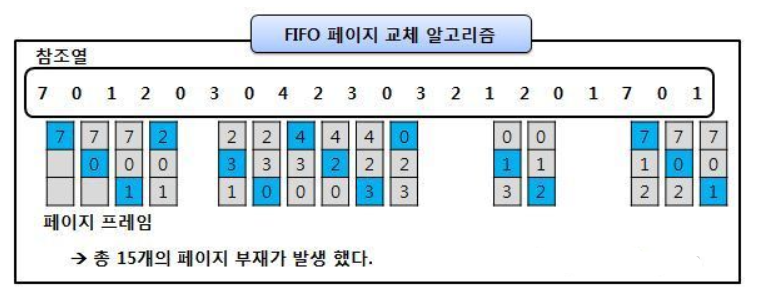
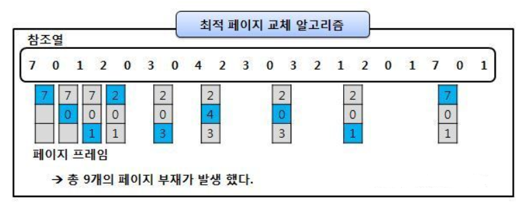
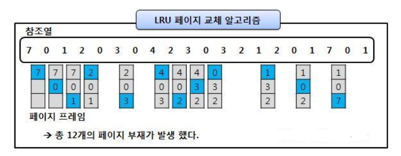

# 💻 페이지 교체 알고리즘

---

> 페이지 부재 발생 -> 새로운 페이지를 할당해야 함 -> 현재 할당된 페이지 중 어떤 것 교체할지 결정하는 방법
> 
> 이해한 바로는 가상 메모리는 '요구 페이지 기법' 을 통해 필요한 페이지 메모리에 적재하고 사용하지 않는 부분은 그대로 둔다.
> 
> 즉, 다 쓴거는 자리만 차지할 수 있으니까 out해주고 필요한 페이지를 in해야한다 이때 out되는 페이지가 (victim page) 라고 부른다
> 기왕이면 수정되지 않는 페이지를 골라야한다 
> 
> why?수정되면 메모리에서 내보낼때 또 하드디스크에서 수정을 해야하므로 시간이 오래걸린다.
> 이와 같은 상황에서 상황에 맞는 페이지 교체를 진행하기 위해 페이지 교체 알고리즘이 존재하는 것!

## 1. ✅ Page Reference String

- CPU는 논리 주소를 통해 특정 주소를 요구한다.

- 메인 메모리에 올라와 있는 주소들은 페이지 단위로 갖고와서 연속된 번호표시 -> 페이지 결함 발생 X
- CPU 주소 요구에 따라 페이지 결함이 일어나지 않는 부분은 생략해서 표시하는 방식이 Page Reference String

## 2. ✅ 페이지 교체 알고리즘 방식

### 2-1. FIFO 알고리즘 (초기화 코드에서 적절한 방식)

> First-In First-Out, 메모리에 먼저 올라온 페이지를 먼저 내보내는 알고리즘 
>
> victim page : out 되는 페이지는, 가장 먼저 메모리에 올라온 페이지

- 초기화 코드 : 처음 프로세스 실행될 때 최초 초기화를 시키는 역할만 진행하고 다른 역할은 수행하지 않으므로, 메인 메모리에서 빼도 괜찮다.
- 하지만 처음 실행시에는 무조건 필요한 코드이므로, FIFO 알고리즘을 사용하면 초기화를 시켜준 후 가장 먼저 내보내는 것이 가능하다.

### 2-2 OPT 알고리즘

> Optimal 알고리즘, 앞으로 가장 사용하지 않을 페이지를 가장 우선적으로 내보냄

- FIFO에 비해 페이지 결함의 횟수를 많이 감소시킬 수 있음
- 하지만 실질적으로 페이지가 앞으로 잘 사용되지 않을 것이라는 보장이 없기 때문에 수행하기 어려운 알고리즘이다.

### 2-3 LRU 알고리즘

> Least-Recently-Used, 최근에 사용하지 않은 페이지를 가장 먼저 내려보내는 알고리즘

- 최근에 사용하지 않았으면, 나중에도 사용되지 않을 것이라는 아이디어에서 나왔다.
- OPT의 경우 미래 예측이지만, LRU는 과거를 보고 판단하므로 실질적으로 사용이 가능한 알고리즘이다.
- OPT보다 페이지 결함이 더 일어날 수 있지만, 실제로 사용할 수 있는 페이지 교체 알고리즘에서는 가장 좋은 방법중 하나이다.

## 3. ✅ 교체 방식

- Global 교체
> 메모리 상의 모든 프로세스 페이지에 대해 교체하는 방식

- Local 교체
> 메모리 상의 자기 프로세스 페이지에서만 교체하는 방식

- 다중 프로그래밍의 경우, 메인 메모리에 다양한 프로세스가 동시에 올라온다. 그래서 다양한 프로세스가 존재하고 페이지 교체시 선정 기준을 글로벌로 할지 로컬로 할지 차이이다. 실제로는 전체를 기준으로 교체하는 것이 더 효율적라고 한다.

---

# 🤔 질문

### 1. 페이지 교체 알고리즘이란?

- 페이지 부재가 발생한다. 새로운 페이지를 할당해줘야하는데 이때 어떤걸 교체할지 결정하는 방법 

### 2. OPT랑 LRU 알고리즘에 대해서 설명해주세요.

- OPT알고리즘은 미래를 예측하여 앞으로 잘 사용 안될 페이지를 내보낸다. 하지만 LRU는 과거를 판단하여 가장 많이 사용 안된 페이지를 내보낸다.

