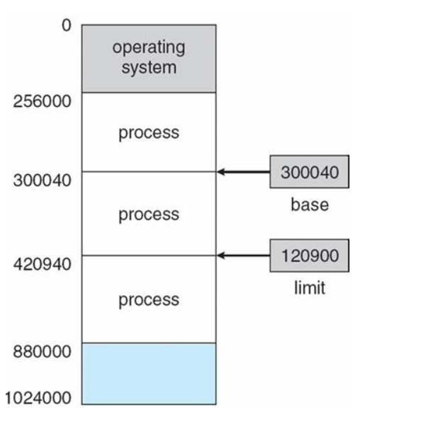

# 💻 메인 메모리

---

> 메인 메모리는 CPU가 직접 접근할 수 있는 기억 장치
> 프로세스가 실행되려면 프로그램이 메모리에 올라와야 한다.

- CPU는 레지스터가 지시하는대로 메모리에 접근하여 다음에 수행할 명령어를 가져온다. 명령어 수행 시 메모리에 필요한 데이터가 없으면 해당 데이터를 우선 가져와야 한다. 이 역할이 MMU이다.

## 1. ✅ MMU - Memory Management Unit

- 논리 주소를 물리주소로 변환해 준다.
- 메모리 보호나 캐시 관리 등 CPU가 메모리에 접근하는 것을 총 관리해주는 하드웨어이다.

> 메모리 공간이 한정적이다. 사용자에게는 메모리를 더 많이 제공해주기 위해 '가상 주소' 라는 개념이 생겨난 것이다. 가상 주소에서 실제 데이터가 담겨있는 곳에 접근하기 위해선 빠른 주소 변환이 필요하다 이를 MMU가 도와준다.

- MMU의 역할 
  - MMU가 지원되지 않으면, 물리주소를 직접 접근해야 하기 때문에 부담이 있다.
  - MMU는 사용자가 기억장소를 일일이 할당해야 하는 불편을 없애준다.
  - 프로세스의 크기가 실제 메모리의 용량을 초과해도 실행될 수 있게 해준다.

또한 메인 메모리의 직접 접근은 비효율 적이므로, CPU와 메인 메모리 속도를 맞추기 위해 '캐시'가 존재한다.

### MMU의 메모리 보호

> 프로세스는 독립적인 메모리 공간을 가져야 되고, 자신의 공간만 접근해야한다.
> 따라서 한 프로세스에게 합법적인 주소 영역을 설정하고, 잘못된 접근이 오면 trap을 발생시키며 보호한다.

- base와 limit 레지스터를 활용한 메모리 보호 기법이다. base 레지스터는 메모리상의 프로세스 시작주소를 물리 주소로 저장 limit 레지스터는 프로세스의 사이즈를 저장한다.
- 이로써 프로세스의 접근 가능한 합법적인 메모리 영역(x)
- 쉽게 설명하면 base ~ base+limit 외의 범위는 trap을 발생시킨다. 이는 커널모드에서만 수정 가능하고 사용자 모드에서는 변경 못한다.

### 메모리 과할당
> 실제 메모리의 사이즈보다 더 큰 사이즈의 메모리를 프로세스에 할당한 상황이다.

- 과할당 상황에 대해서 사용자를 속인 것을 들킬만한 상황이 존재한다.
  - 프로세스 실행 도중 페이지 폴트 발생
  - 페이지 폴트를 발생시킨 페이지 위치를 디스크에서 찾음.
  - 메모리의 빈 프레임에 페이지를 올려야 하는데, 모든 메모리가 사용중이라 빈 프레임이 없음
- 이러한 과할당을 해결하기 위해선, 빈 프레임을 확보할 수 있어야 한다.
  - 메모리에 올라와 있는 한 프로세스를 종료시켜 빈 프레임을 얻는다.
  - 프로세스 하나를 swap out하고, 이 공간을 빈 프레임으로 활용한다.

### 페이지 교체
> 메모리 과할당이 발생했을 때, 프로세스 하나를 swap out해서 빈 프레임을 확보하는 것

1. 프로세스 실행 도중 페이지 부재 발생
2. 페이지 폴트를 발생시킨 페이지 위치를 디스크에서 찾음
3. 메모리에 빈 프레임이 있는지 확인
    > 빈 프레임이 있으면 해당 프레임 사용 -> 없으면 victim 프레임 선택해서 디스크에 기록하고 페이지 테이블 업데이트
4. 빈 프레임에 페이지 폴트가 발생한 페이지를 올리고, 페이지 테입르 업데이트
- 아무일도 일어나 지않은것처럼 페이지 교체하고 오버헤드를 줄여야한다.

### 오버헤드를 감소시키는 방법
- 만약 빈 프레임이 없으면 victim 프레임을 많이 체크해야하므로 접근이 많아짐에 따라 오버헤드가 발생한다 이를 줄여야한다.

1. 변경 비트를 모든 페이지마다 둬서 victim 페이지가 정해지면 해당 페이지의 비트를 확인한다.
- 비트가 set 상태면 -> 해당 페이지 내용이 디스크상 페이지내용과 달라서 업데이트 안됐다는 뜻이니까 기록
- 비트가 clear 상태면 -> 디스크상 페이지랑 메모리상 페이지가 같기에 기록할 필요 없다. 
- 이런식으로 디스크에 기록하는 횟수를 줄이면서 오버헤드에 대한 수를 최대 절반으로 감소시킨다.

2. 페이지 교체 알고리즘을 상황에 따라 잘 선택해서 페이지 폴트를 발생할 확률을 최대한 줄여주는 교체 알고리즘을 사용한다.

## 2. ✅ 캐시 메모리
> 주기억장치에 저장된 내용의 일부를 임시로 저장해두는 기억장치. CPU와 주기억장치의 속도 차이로 성능 저하를 방지하기 위한 방법

- 자주 사용하는 메모리를 캐시에 저장해서 비용을 절감하는 방식 

- CPU와 기억장치의 상호작용
  - CPU에서 주소를 전달 -> 캐시 기억장치에 명령이 존재하는지 확인 -> hit -> 해당 명령어를 cpu로 전송 -> 완료 
  - 비존재 miss -> 명령어 갖고 주기억장치 접근 -> 해당 명령어를 가진 데이터 인출 -> 해당 명령어 데이터를 캐시에 저장 -> 해당 명령어를 CPU로 전송 -> 완료

- 이처럼 캐시를 잘 사용하면 비용을 많이 줄일 수 있다. 적중률을 극대화 시켜야하는데 이게 지역성의 원리

> 지역성이란 기억 장치 내의 정보를 균일하게 액세스 하는 것이 아니라 한 순간에 특정 부분을 집중적으로 참조하는 특성이다.

- 시간 지역성 : 최근에 참조된 주소의 내용은 곧 다음에도 참조되는 특성
- 공간 지역성 : 실제 프로그램이 참조된 주소와 인접한 주소의 내용이 다시 참조되는 특성

- 캐싱 라인 
  - 빈벅하게 사용되는 데이터를 캐시에 저장했더라도, 내가 필요한 데이터를 캐시에서 찾을 때 모든 데이터를 순회 하는 것은 시간 낭비.
  - 즉, 캐시에 목적 데이터가 저장되어있을때 바로 접근하여 출력할 수 있어야 캐시 활용이 의미있어진다.
  - 따라서 캐시에 데이터를 저장할 시, 자료 구조를 활용해 묶어서 저장하는데 이를 캐싱라인이라 부른다. set, map을 활용해 저장

---

# 🤔 질문

### 1. MMU란?
- 논리 주소를 물리 주소로 변환해주고 메모리 보호나 캐시 관리 등 CPU가 메모리에 접근하는 것을 총 관리해주는 하드웨어이다.

### 2. MMU는 어떻게 보호하는가?
- base limit을 활용해 해당 구역 외에 메모리가 접근하면 trap을 발생시킨다.

### 3. 캐시메모리란?
- 자주 사용되는 데이터들을 캐시메모리에 저장하여 비용을 절감하는 방식이다. 

