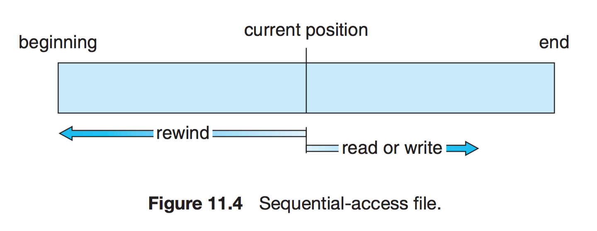
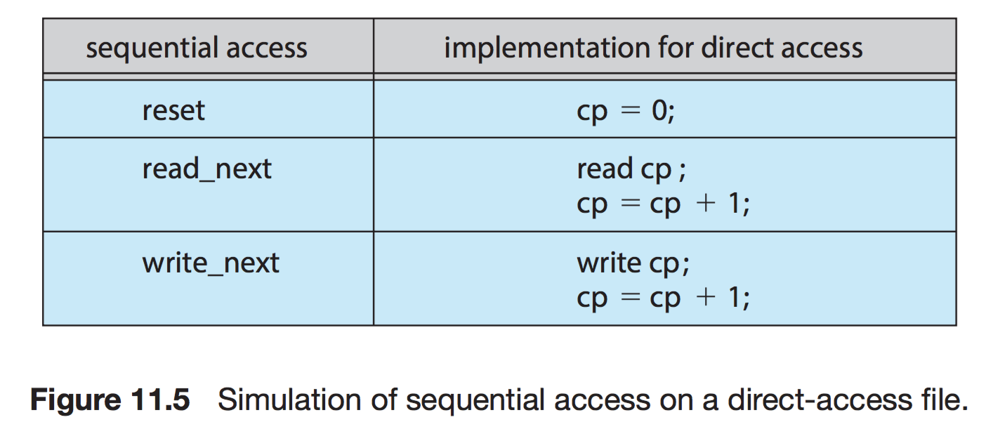
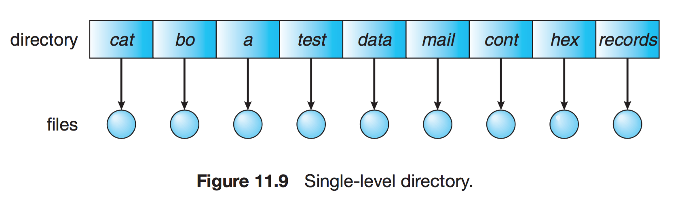
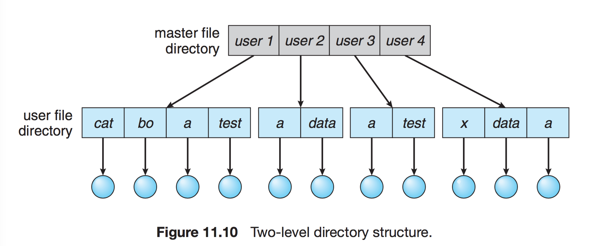
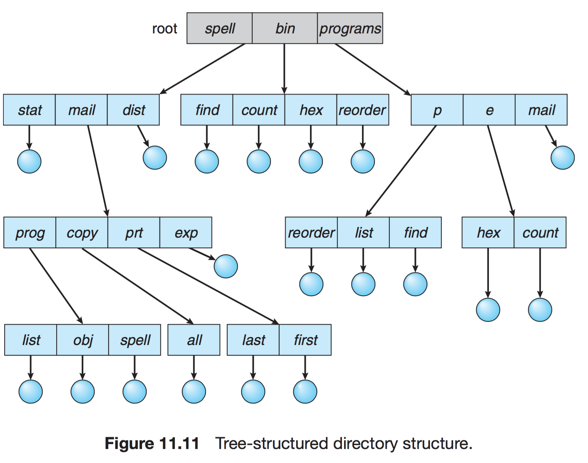
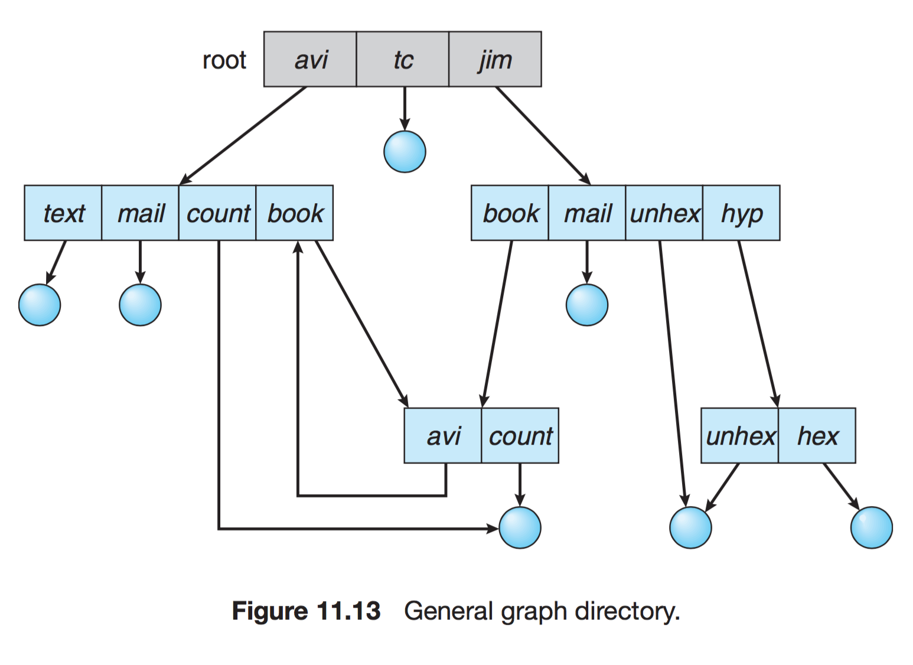

# 💻 파일 시스템

> 컴퓨터에서 파일이나 자료를 쉽게 발견할 수 있도록, 유지 및 관리하는 방법이다.
> 저장매체에는 수많은 파일이 있기 때문에, 이런 파일들을 관리하는 방법을 말한다.

---

## 1. ✅ 파일 시스템

- 특징
  - 커널 영역에서 동작
  - 파일 CRUD 기능을 원활히 수행하기 위한 목적
  - 계층적 디렉터리 구조를 가진다.
  - 디스크 파티션 별로 하나씩 둘 수 있다.
- 역할
  - 파일 관리
  - 보조 저장소 관리
  - 파일 무결성 메커니즘
  - 접근 방법 제공
- 개발 목적
  - 하드 디스크와 메인 메모리 속도차를 줄이기 위함
  - 파일 관리
  - 하드디스크 용량 효율적 이용
- 구조
  - 메타 영역: 데이터 영역에 기록된 파일의 이름, 위치, 크기, 시간정보, 삭제유무 등의 파일 정보
  - 데이터 영역: 파일의 데이터

## 2. ✅ 접근 방법

### 순차 접근

> 가장 간단한 접근 방법으로, 대부 연산은 읽기, 쓰기
- 현재 위치를 가리키는 포인터에서 시스템콜이 발생할 경우 포인터를 앞으로 보내면서 read, write를 진행. 뒤로 돌아갈 땐 지정한 offset 만큼 되감기를 해야한다.

### 직접 접근

> 특별한 순서 없이, 빠르게 레코드를 read, write 가능하다.

- 현재 위치를 가르키는 'cp'변수만 유지하면 직접 접근 파일을 가지고 순차 파일 기능을 쉽게 구현 가능하다.
- 무작위 파일에 대한 임의의 접근을 허용한다. 따라서 순서 제약 X
- 대규모 정보 접근할때 유용하기에 'DB'에서 사용된다.

### 기타 접근

> 직접 접근 파일에 기반하여 색인 구축

- 크기가 큰 파일을 입출력 탐색할 수 있게 도와주는 방법이다.

## 3. ✅ 디렉터리와 디스크 구조

### 1단계 디렉터리
> 가장 간단한 구조

- 파일들은 서로 유일한 이름을 가짐, 서로 다른 사용자라도 같은 이름 사용 불가

### 2단계 디렉터리
> 사용자에게 개별적인 디렉터리 만들어줌

- UFD : 자신만의 사용자 파일 디렉터리
- MFD : 사용자의 이름과 계정번호로 색인되어 있는 디렉터리

### 트리 구조 디렉터리
> 2단계 구조 확장된 다단계 트리 구조

- 한 비트를 활용하여, 일반 파일(0)인지 디렉터리 파일(1) 구분

### 그래프 구조 디렉터리
> 순환이 발생하지 않도록 하위 디렉터리가 아닌 파일에 대한 링크만 허용하거나, 가비지 컬렉션을 이용해 전체 파일 시스템을 순회하고 접근 가능한모든 것을 표시

- 링크가 있으면 우회하여 순환을 피할 수 있다.
---

# 🤔 질문

### 1. 파일시스템의 구조는 어떻게 되나요?
- 메타영역과 데이터 영역으로 나뉩니다. 데이터 영역에 기록된 파일의 이름, 위치, 크기... 이런것들이 메타 영역에 저장되며 데이터영역에는 파일의 데이터가 저장됩니다.

### 2. 데이터베이스에 활용되는 파일시스템 방식이 무엇인가요?

- 직접 접근 방식으로 cp 변수만 유지하면 직접 접근 파일을 가지고 순차 파일 기능을 쉽게 구현이 가능합니다. 무작위 접근이 가능해서 순서의 제약이 없기에 대규모 정보를 접근할때 유용합니다.

