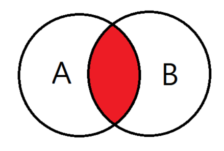
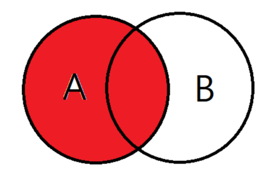
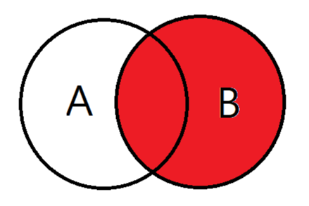
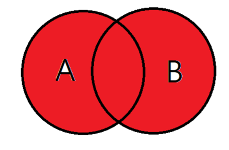
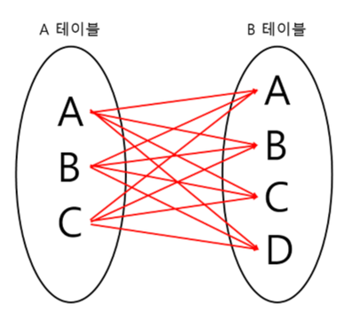
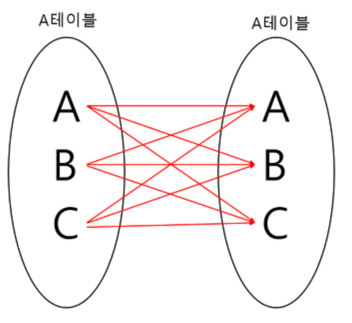

# 💻 Join

---

> 두 개 이상의 테이블이나 데이터베이스를 연결하여 데이터를 검색하는 방법
> 
> 테이블을 연결하려면, 적어도 하나의 칼럼을 서로 공유하고 있어야 하므로 이를 이용하여 데이터 검색에 활용한다.

## 1. ✅ Join 종류

### INNER JOIN

- 교집합으로, 기준 테이블과 join 테이블의 중복된 값을 보여준다.

### LEFT OUTER JOIN

- 기준테이블값과 조인테이블과 중복된 값을 보여준다.
- 왼쪽 테이블 기준으로 Join을 한다. 그저 A보여주고 B랑 중복된것도 보여주는거다.

### RIGHT OUTER JOIN

- LEFT OUTER JOIN과는 반대로 오른쪽 테이블 기준으로 JOIN하는 것이다.

### FULL OUTER JOIN

- 합집합을 말한다. A와 B 테이블 모든 테이터 검색이다.

### CROSS JOIN

- 모든 경우의 수를 전부 표현해주는 방식이다.
- 위 그림은 3 * 4로 12개의 데이터가 검색된다.

### SELF JOIN

- 자기자신과 자기자신을 조인하는 것이다.
- 하나의 테이블을 여러번 복사해서 조인한다 (댓글, 대댓글)
- 자신이 갖고 있는 칼럼을 다양하게 변형시켜 활용할때 자주 사용한다.

---

# 🤔 질문

### 1. 다들.. 잘 알죠? 

