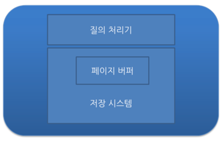

# 💻 DB 트랜잭션

---
> 데이터베이스의 상태를 변화시키기 위해 수행되는 작업 단위

## 1. ✅ 트랜잭션의 특징

- 원자성 : 트랜잭션이 DB에 모두 반영되거나, 혹은 전혀 반영되지 않아야 한다.
- 일관성 : 트랜잭션의 작업 처리 결과는 항상 일관성 있어야 한다.
- 독립성 : 둘 이상의 트랜잭션이 동시에 병행 실행되고 있을 때, 어떤 트랜잭션도 다른 트랜잭션 연산에 끼어들 수 없다.
- 지속성 : 트랜잭션이 성공적으로 완료되었으면, 결과는 영구적으로 반영되어야 한다.

1. Commit : 하나의 트랜잭션이 성공적으로 끝나고 DB가 일관성있는 상태일 때 이를 알려주기 위해 사용되는 연산
2. RollBack : 하나의 트랜잭션 처리가 비정상적으로 종료되어 트랜잭션 원자성이 깨진 경우, 트랜잭션이 정상적으로 종료되지 않았을때 원래로 롤백할 수 있음

## 2. ✅ 트랜잭션 관리를 위한 DBMS의 전략
- 이해를 위한 2가지 개념 : DBMS의 구조 / Buffer 관리 정책

1. DBMS의 구조

> 크게 2가지 : 질의 처리기, 저장 시스템
> 
> 입출력 단위 : 고정 길이의 페이지 단위로 disk에 읽거나 쓴다.
> 
> 저장 공간 : 비휘발성 저장 장치인 disk에 저장, 일부분을 Main Memory에 저장

2. Page Buffer Manager or Buffer Manager
> DBMS의 Storage System에 속하는 모듈 중 하나로, Main Memory에 유지하는 페이지를 관리하는 모듈
> 
> Buffer 관리 정책에 따라, UNDO 복구와 REDO 복구가 요구되거나 그렇지 않게 되므로, 트랜잭션 관리에 매우 중요한 결정을 가져온다.

3. UNDO
- 필요한 이유 : 수정된 Page들이 버퍼 교체 알고리즘에 따라서 디스크에 출력될 수 있다. 버퍼 교체는 트랜잭션과는 무관하게 버퍼의 상태에 따라서 결정된다. 이로 인해 정상적으로 종료되지 않은 트랜잭션이 변경한 페이지들은 원상복구 되어야 하는데 이 복구를 undo라고 한다.
- 2개의 정책 (수정된 페이지를 디스크에 쓰는 시점으로 분류)

4. REDO
- 이미 커밋한 트랜잭션의 수정을 재반영하는 복구 작업
- 버퍼 관리 정책에 영향을 받는다.

---

# 🤔 질문

### 1. 트랜잭션이 뭐죠?
- 데이터베이스 상태를 변화시키기 위해 수행하는 하나의 작업 '단위'

### 2. 트랜잭션 특징 4가지는?
- 원자성, 일관성, 독립성, 지속성

