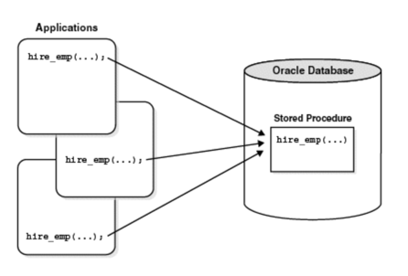

# 💻 저장 프로시저

---

## 1. ✅ 저장 프로시저란?

> 일련의 쿼리를 마치 하나의 함수처럼 실행하기 위한 쿼리 집합

- 애플리케이션에서 여러 상황에 따라 해당 쿼리문이 필요할 때 인자 값만 전달하여 쉽게 원하는 결과물을 받아낼 수 있다.

## 2. ✅ 프로시저 장점

- 최적화 & 캐시
  - 포로시저의 최초 실행 시 최적화 상태로 컴파일이 되며, 그 이후 프로시저 캐시에 저장 된다.
  - 만약 해당 프로세스가 여러번 사용될 때, 다시 컴파일 작업을 거치지 않고 캐시에서 가져오게 된다.
- 유지 보수
  - 작업이 변경될 때, 다른 작업은 건드리지 않고 프로시저 내부에서 수정하면 된다.
- 트래픽 감소
  - 클라이언트가 직접 SQL문을 작성하지 않고, 프로시저명에게 매개변수만 담아 전달하면 된다. 즉 ,SQL문이 서버에 이미 저장되어있기때문에 클라이언트와 서버 간 네트워크 상 트래픽이 감소된다.
- 보안
  - 프로시저 내에서 참조 중인 테이블의 접근을 막을 수 있다.

## 3. ✅ 프로시저 단점
- 호환성
  - 구문 규칙이 SQL/PSM 표준과의 호환성이 낮기 때문에 코드 자산으로의 재사용성이 나쁘다.
- 성능
  - 문자 또는 숫자 연산에서 프로그래밍 언어인 C나 Java보다 성능이 느리다.
- 디버깅
  - 에러가 발생했을때 어디서 발생한지 모른다.
 

