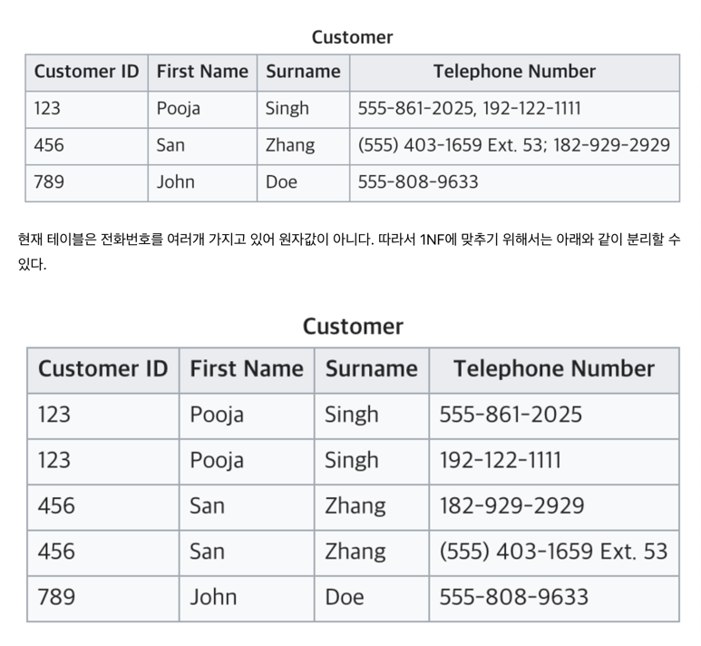
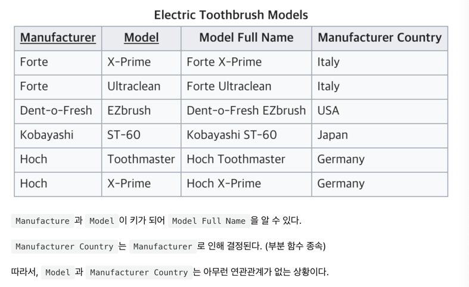
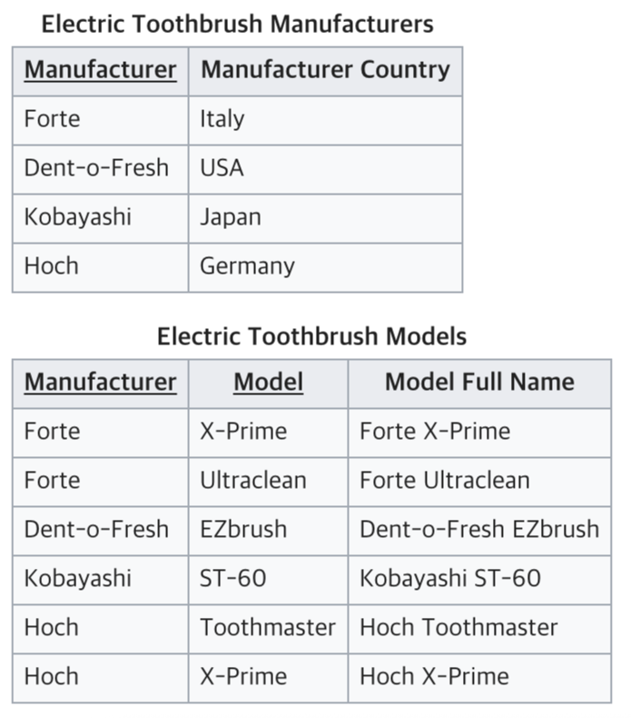
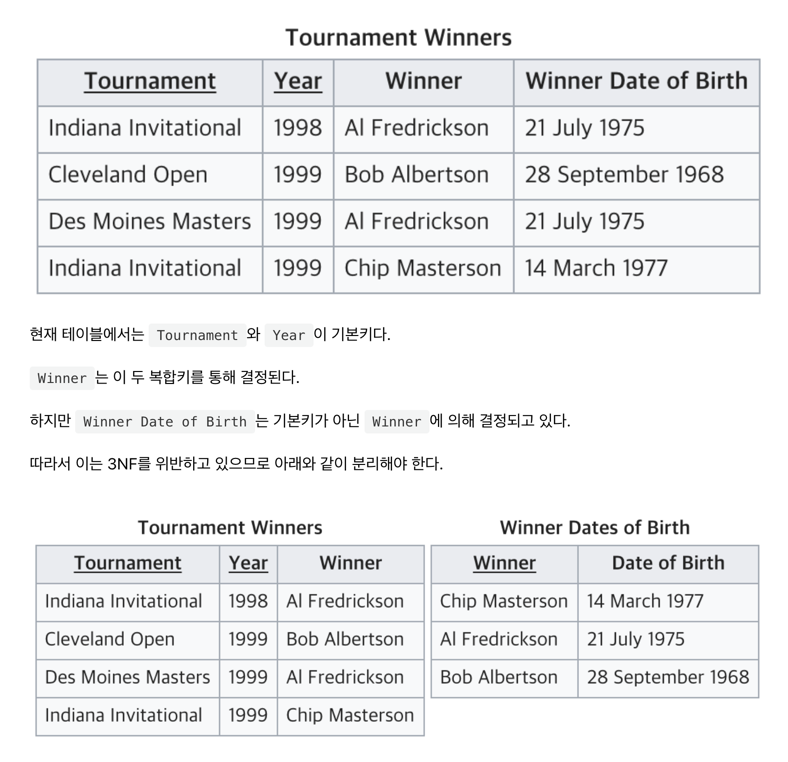

# 💻 정규화

---

> 데이터의 중복을 줄이고, 무결성을 향상시킬 수 있다.

## 1. ✅ 목적

> 중복된 데이터를 허용하지 않는 것,
> 
> 중복된 데이터를 만들지 않으면, 무결성을 유지할 수 있고, DB 저장 용량 또한 효율적으로 관리할 수 있다.

## 2. ✅ 정규화

### 제 1정규화
> 테이블 컬럼이 하나의 값을 갖도록 테이블을 분리시키는 것을 말한다.

- 어떤 릴레이션에 속한 모든 도메인이 원자값만으로 되어 있어야 한다.
- 모든 속성에 반복되는 그룹이 나타나지 않는다.
- 기본키를 사용하여 관련 데이터의 각 집합을 고유하게 식별할 수 있어야 한다.

### 제 2정규화

> 테이블의 모든 컬럼이 완전 함수적 종속을 만족해야 한다.
> 
> 기본키의 부분집합 키가 결정자가 되어선 안된다는 것

### 제 3정규화

> 2NF가 진행된 테이블에서 이행적 종속을 업애기 위해 테이블을 분리하는 것

> 이행적 종속 : A -> B, B -> C 면 A -> C가 성립된다.

- 릴레이션이 제 2정규화에 만족한다.
- 기본키가 아닌 속성들은 기본키에 의존한다.

## 3. ✅

---

# 🤔 질문

### 1. 정규화의 목적은?
- 무결성 지키며, 이상현상을 방지한다. 중복도 없애며 불필요한 데이터 최소화, 그리고 테이블을 논리적으로 구성 가능

### 2. 

