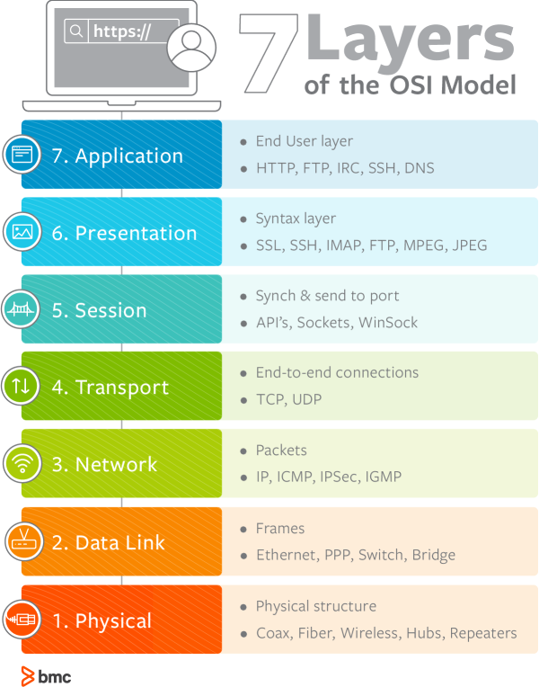

# 💻 OSI 7계층

---

> 통신이 일어나는 과정을 7개의 단계로 나눈 지표

## 1. ✅ OSI 7계층은 왜 나누는 것일까?

> 통신이 일어나는 과정을 단계별로 알 수 있고, 특정한 곳에 이상이 생기면 그 단계만 수정할 수 있기 때문이다.

## 2. ✅ OSI 7계층별 단계

### 1) 물리 단계 (데이터 전송 역할)

> 리피터, 케이블, 허브 등.. 

- 단지 데이터 전기적인 신호로 변환해서 주고받는 기능을 진행하는 공간
- 즉, 데이터를 전송하는 역할만 진행한다 

### 2) 데이터 링크 (물리 계층 송수신 정보 관리)

> 브릿지, 스위치 등..

- 물리 계층으로 송수신되는 정보를 관리하여 안전하게 전달되도록 도와주는 역할
- Mac 주소를 통해 통신한다. 프레임에 mac 주소를 부여하고 에러검출, 재전송, 흐름제어를 진행한다.

### 3) 네트워크 (데이터를 목적지까지 전달하는 기능)

> 라우터, IP

- 데이터를 목적지까지 안전하고 빠르게 전달하는 기능
- 라우터를 통해 이동하라 경로를 선택하여 IP 주소 지정, 경로를 따라 패킷을 전달
- 라우팅, 흐름제어, 오류제어, 세그먼테이션 수행한다.

## 3. ✅

---

# 🤔 중요 내용 요약 복습

### 1. 

### 2.

