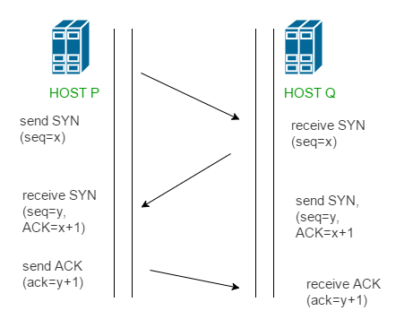
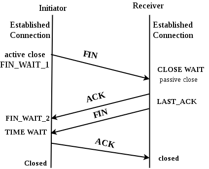

# 💻 [TCP] 3 way handshake & 4 way handshake

> 연결을 성립하고 해제하는 과정

---

## 1. ✅ 3 way handshake - 연결

- TCP 는 정확한 전송을 보장해야한다. 따라서 통신하기에 앞서, 논리적인 접속을 성립하기 위해 3way handshake 과정을 진행한다.

1. 클라이언트가 서버에게 SYN 보냄
2. 서버가 SYN 받고, 클라이언트로 받았다는 신호 ACK + SYN 보냄
3. 클라이언트는 서버의 응답 ACK + SYN 받고 ACK + 1을 보냄

## 2. ✅ 4 way handshake - 연결 해제

연결 이후 통신을 해제해야한다

1. 클라이언트는 서버에게 연결 종료한다는 FIN 플래그 전송
2. 서버는 FIN을 받고, 확인했다는 ACK를 클라이언트에게 보낸다. (이때 모든 데이터를 보내기 위해 CLOSE_WAIT 상태)
3. 데이터를 모두 보냈다면, 연결이 종료되었다는 FIN 플래그를 클라이언트에게 보낸다.
4. 클라이언트는 FIN을 받고, 확인했다는 ACK를 서버에게 보낸다. (완벽히 끝난것은 아님 대기)
5. 서버는 ACK를 받은 이후 소켓 닫음
6. TIME_WAIT 시간이 끝나면 클라이언트도 닫음

## 3. ✅

---

# 🤔 중요 내용 요약 복습

### 1. 3 way handshake는 연결, 4 way handshake는 연결 해제

### 2. 연결해제시 바로 끊기는게 아니라 일부 미전송 데이터 송수신을 위해 완벽히 끊기지않음

