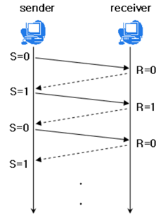
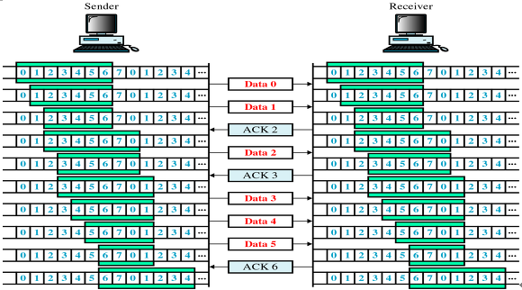
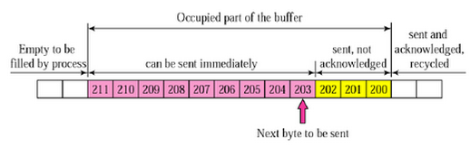
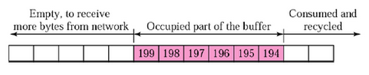
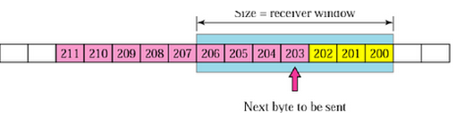
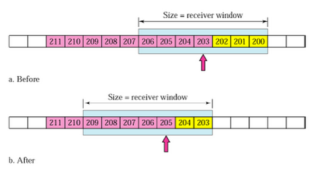

# 💻 TCP/IP (흐름제어/혼잡제어)

---

## 1. ✅ 용어정리

- TCP 통신?
  - 네트워크 통신에서 신뢰적인 연결 방식
  - TCP는 기본적으로 unreliable network(신뢰할 수 없는 네트워크) -> 신뢰가능한 네트워크를 보장해주는 프로토콜
  - TCP는 network congestion avoidance algorithm (네트워크 혼잡 회피 알고리즘?) 사용 한답니다.

- reliable network 보장한다 -> 4가지 문제점 존재
  - 손실 : 패킷이 손실될 수 있는 문제
  - 순서 바뀜 : 패킷의 순서가 바뀌는 문제
  - 혼잡 : 네트워크가 혼잡한 문제
  - 오버로드 : 수신자가 오버로드 되는 문제 -> 오버로드가 이제 넘친다는 뜻인듯

- 흐름제어/혼잡제어란?
  - 흐름제어
    - 송신측/수신측 데이터 처리 속도 차이 해결 기법
    - Flow Control은 수신자가 패킷을 지나치게 받지 않도록 조절하는 것 -> 과하게 흐르는 것 방지
    - 기본 개념은 수신자가 송신자에게 현재 자신의 상태를 피드백 한다는 점 -> 알린다는 뜻
  - 혼잡제어 : 송신측의 데이터 전달과 네트워크 데이터 처리 속도 차이를 해결하기 위한 기법

## 2. ✅ 흐름제어 

- 데이터 속도 처리 - 수신측 > 송신측 -> 이 경우 문제 없다. 그치만 송신측의 속도가 빠르면 문제 존재
- 수신측에서 제한된 저장 용량 초과 이후 데이터 손실 -> 손실된다면 불필요하게 응답과 데이터 전송이 송/수신 측 간에 빈번이 발생
- 이러한 위험을 줄이기 위해 손신 측의 데이터 전송량을 수신측에 따라 조절,
  - -> 즉 받는사람이 처리를 다 하기 전에 보내는사람이 너무 많이 보내면 문제가 발생한다는걸 흐름제어를 통해 억제

- 해결 방법
  - Stop and Wait : 매번 전송한 패킷에 대해 확답 받아야 다음 패킷 전송
    - 
  - Sliding Window
    - 수신측에서 설정한 윈도우 크기만큼 송신측에서 확답 없이 세그먼트를 전송할 수 있게 하여 데이터 흐름을 동적으로 조절하는 제어기법
    - 전송은 되었지만, acked를 받지 못한 byte의 숫자를 파악하기 위해 사용하는 프로토콜
    - 보낸것 - 응답받은것 <= 남은 윈도우 공간 == 현재 공중에 떠잇는 패킷 수
  - 동작 방식 : 먼저 윈도우에 포함되는 모든 패킷을 전송 -> 그 패킷들의 전달 확인되는대로 이 윈도우를 옆으로 옮김으로써 그 다음 패킷들을 전송
    - 
  - Window : TCP/IP를 사용하는 모든 호스트들은 송신하기 위한 것과 수신하기 위한 2개의 Window를 갖고 있다. 호스트들은 실제 데이터를 보내기 전에 3 way handshaking 을 통해 수신 호스트의 응답윈도우 사이즈에 자신의 전송윈도우 사이즈를 맞춘다.
  
- 세부 구조
  - 1. 송신 버퍼
    - 
    - // -200 이전의 바이트는 이미 전송됨, 노란색은 확인 응답 못받음, 핑크색은 아직 미전송
  - 2. 수신 윈도우
    - 
  - 3. 송신 윈도우
    - 
    - 수신 윈도우보다 작거나 같은 크기로 송신 윈도우를 지정하게되면 흐름제어 가능
  - 4. 송신 윈도우 이동
    - 
    - Before : 203 ~ 204를 전송하면 수신측에서는 확답 203 보내고 송신측은 이를 받아 after과 같이 수신 윈도우를 203 ~ 209 로 이동 - after : 205 ~ 209 전송 가능 상태
  - 반복함

## 3. ✅ 혼잡 제어

> 보내는 사람의 데이터는 지역망, 대형 네트워크로 전송 -> 이떄 하나의 라우터로 몰린다면? 자신이 모두 처리못한다.
> 
> 그치만 이런 경우 호스트는 재전송 -> 처리 모두 못하니까 혼잡 증가
> 
>  그렇기 떄문에 이를 제어해야겠지? -> 혼잡제어 // 흐름제어가 송수신측 사이의 전송속도를 다룬다면, 혼잡제어는 호스트와 라우터를 포함한 보다 넓은 관점에서 전송 문제를 다룬다.

- 해결 방법
  - AI/MD (추가적인(++) 증가 / 곱셈식의(--인데 곱하기) 감소)
    - 처음 패킷 하나씩 보냄 -> 이떄 괜찮으면 하나씩 증가
    - 패킷 전송 실패, 일정 시간 넘으면 -> 패킷 보내는 속도 절반 줄임
    - 공평한 방식으로, 여러 호스트가 네트워크 공유중이면 나중에 진입하는게 불리하지만 시간이 지나면 평형상태 수렴
    - 문제점 : 초기 네트워크의 높은 대역폭 사용 못함 -> 오랜 시간 걸림, 네트워크 혼잡해지는 상황 미리 감지 못함 -> 네트워크 혼잡해지고 나서야 대역폭 줄임
  - Slow Start
    - 이방식은 AIMD처럼 하나씩 패킷을보내며 시작 -> 이때 문제 없으면 window size 1씩 늘림 -> 한 주기 지나면 2배
    - 전송속도는 AIMD에 반해 지수함수 꼴로 증가, 대신 혼잡 발생시 window size == 1
    - 처음 네트워크 수용량 예상 정보 X, 한 번 혼잡 현상이 발생하고 나면 네트워크 수용량 예상 가능
    - 즉, 혼잡 현상이 발생하였던 window size의 절반까지는 이전처럼 지수 함수 꼴로 창 크기를 증가시킴 -> 이후 1씩 증가
  - Fast Retransmit (빠른 재전송)
    - 패킷을 받는 쪽에서 먼저 도착해야할 패킷이 도착하지 않고, 다음 패킷이 도착한 경우에도 ACK 패킷 보냄 (위 2개와 차이점)
    - 단, 순서대로 잘 도착하면 다음 패킷의 순번을 ACK 패킷에 실어서 보내므로 중간 소실되면 송신 측에서 순번이 중복된 ACK 패킷 받음 -> 이때 문제가 되는 패킷 재전송 가능
    - 중복된 순번의 패킷을 3개 받으면 재전송 -> 약간 혼잡 상황이 일어난 것이므로 혼잡 감지하고 window size 줄임
  - Fast Recovery (빠른 회복)
    - 혼잡한 상태가 되면 window size를 1로 줄이지 않고 반으로 줄이고 선형증가 시킴 -> 이 정책까지 적용하면 혼잡 상황을 한 번 겪고나서부터 AIMD 방식으로 동작

---

