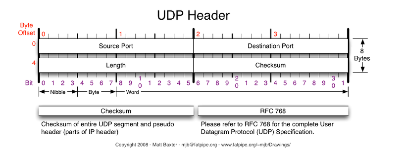

# 💻 UDP

---

## 1. ✅ 용어정리

- UDP란?
  - User Datagram Protocol -> 데이터를 데이터 그램 단위로 처리
  - 비연결형, 신뢰성 없는 전송 프로토콜
  - 데이터 그램 단위로 쪼개면서 전송을 해야하기때문에 '전송계층'

- TCP vs UDP  왜 나뉜거지?
  - 1. IP역할은 Host to Host 만을 지원 -> 장치에서 장치 이동은 IP로 해결되지만, 하나의 장비안에서 수많은 프로그램 통신 -> 한계 존재
  - 2. 또한, IP에서 오류 발생하면 ICMP에서 알려줌 -> 하지만 알려주기만 할뿐 대처 못함 -> IP위에서 처리해줘야함
  - a를 해결하기 위해 포트번호가 나오게되었고, b를 해결하기 위해 상위 프로토콜인 TCP, UDP가 등장
  > ICMP : 인터넷 제어 메시지 프로토콜로 네트워크 컴퓨터 위에서 돌아가는 운영체제에서 오류 메시지를 전송바든ㄴ데 주로 쓰인다.

- 그러면 어떻게 TCP, UDP가 오류를 해결?
  - TCP
    - 데이터의 분실, 중복, 순서가 뒤바뀜 등을 자동으로 보정 -> 송수신 데이터의 정확한 전달을 할 수 있도록 해줌
  - UDP
    - IP가 제공하는 정도의 수준만을 제공하는 간단한 IP상위 계층 프로토콜 -> TCP와 다르게 오류날 수 있고, 재전송이나 순서 뒤바뀔 수 있어, 어플리케이션에서 처리하는 번거로움 존재

- 왜 UDP?
  - 가장 큰 장점 '신속성'
  - 주로 실시간 방송, 온라인 게임에서 사용됨

## 2. ✅  UDP HEADER

- Source port: 시작 포트
- Destination Port : 도착지 포트
- Length : 길이
- Checksum : 오류 검출
  - 중복 검사의 한 형태로, 오류 정정을 통해 공간이나 시간 속에서 송신된 자료의 무결성을 보호하는 단순한 방법

> 위처럼 간단하기에 TCP보다 용량 가볍고 송신 빠름, 그러나 응답 확인 못하기에 신뢰도 저하

## 3. ✅ DNS와 UDP 통신 프로토콜을 사용

- DNS는 데이터를 교환하는 경우,
- 이때, TCP를 사용하게 되면, 데이터를 송신할 때까지 세션 확립을 위한 처리를 하고, 송신한 데이터가 수신되었는지 체크 -> 너무 UDP에 비해서 크다.

---
- DNS는 Application layer protocol (응용계층)
- 모든 응용계층은 TCP, UDP중 하나의 전송계층을 사용해야함 
- DNS는 신뢰적이여야할거같은데 왜 UDP? -> 오 질문 날카로움
  - TCP 3way handshake를 사용하는 반면, UDP는 연결 유지할  필요 없음
  - DNS request는 UDP segment에 꼭 들어갈 정도로 작음.
  - UDP는 비신뢰나, 신뢰성있는 응용계층에 추가될 수 있음
--- 
- 그러나 TCP를 사용하는 경우가 있다. 
- Zone transfer을 사용해야하는 경우에는 TCP를 사용해야 함.
  - Zone Transfer : DNS 서버간의 요청을 주고 받을 때 사용하는 transfer
  - 만약 데이터가 512bytes 넘으면 TCP로 함

---

# 🤔 중요 내용 요약 복습

### 1. DNS는 UDP로 주로 한다. 용량 작아서 괜찮다 넘어가면 TCP

