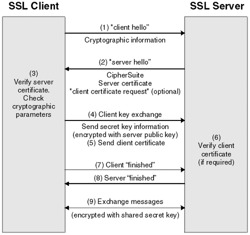

# 💻 TLS/SSL HandShake

> HTTPS에서 클라이언트와 서버간 통신 전 SSL 인증서로 신뢰성 여부를 판단하기 위해 연결하는 방식

---

## 1. ✅ 진행 순서

1. 클라이언트는 서버에게 "안녕" 메시지를 담아 서버로 전송, 이때 암호화된 정보를 함께 담는다. (버전, 암호 알고리즘, 압축 방식)
2. 서버는 클라이언트가 보낸 암호 알고리즘과 압축 방식을 받는다.
    - 세션 ID와 CA 공개 인증서를 "안녕" 메시지와 함께 담아 응답한다.
    - 이 CA인증서에는 앞으로 통신 이후 사용할 대칭키가 생성되기 전, 클라이언트에서 handshake 과정 속 암호화에 사용할 공개키를 담고 있다.
3. 클라이언트 측은 서버에서 보낸 CA 인증서에 대해 유효한지 CA 목록에서 확인하는 과정을 진행
4. CA인증서에 대한 신뢰성이 확보되었다면, 클라이언트는 난수를 생성하여 서버의 공개키로 암호화한다. 이 난수 바이트는 대칭키를 정하는데 사용되고, 앞으로 서로 메시지를 통신할 때 함호화하는데 사용
5. 만약 2번 단계에서 서버가 클라이언트 인증서를 함께 요구했다면, 클라이언트의 인증서와 클라이언트의 개인키로 암호화된 임의의 바이트 문자열을 함께 보낸다.
6. 서버는 클라이언트의 인증서를 확인 후, 난수 바이트를 자신의 개인키로 복호화 후 대칭 마스터키 생성에 활용한다.
7. 클라이언트는 handshake 과정이 완료되었다는 "끝남" 메시질르 서버에 보내면서, 지금까지 보낸 교환 내역들을 해싱 후 그 값을 대칭키로 암호화하여 같이 담아 보내준다.
8. 서버도 동일하게 교환 내용들을 해싱한 뒤 클라이언트에서 보내준 값과 일치하는지 확인한다. 일치하면 서버도 마찬가지로 "끝남" 메시지를 이번에 만든 대칭키로 암호화하여 보낸다.
9. 클라이언트는 해당 메시지를 대칭키로 복호화하여 서로 통신이 가능한 신뢰받은 사용자란 걸 인지하고, 앞으로 클라이언트와 서버는 해당 대칭키로 데이터를 주고 받을 수 있게 된다.

---

# 🤔 중요 내용 요약 복습

### 1. 전체 흐름을 복습하자. 말로 할 수 있도록 

