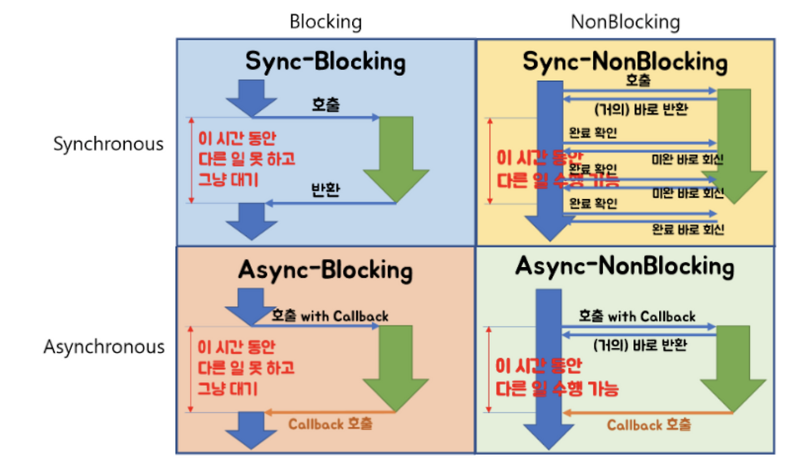

# 💻 블로킹/논블로킹 & 동기/비동기

> 블로킹과 동기, 논블로킹과 비동기는 같은 개념이 아니다.

---

## 1. ✅ 블로킹/논블로킹

> 블록/논블록은 간단히 말해서 '호출된 함수'가 '호출한 함수'에게 제어권을 건네주는 유무의 차이

> 함수 A, B가 있고, A안에서 B를 호출했다면, 이때 호출한 함수는 A고, 호출된 함수는 B가 된다. 현재 B가 호출되면서 B는 자신의 일을 진행해야 한다. (제어권이 B에게 주어진 상황)

- Blocking : 함수 B는 내 할일을 다 마칠때까지 제어권을 가지고 있고 A는 B가 끝날때까지 대기
- Non-Blocking : 함수 B는 할 일을 마치지 않았어도 A에게 제어권을 바로 넘겨준다. A는 B를 기다리면서 다른일 진행 가능

즉, 호출된 함수에서 일을 시작할때 바로 제어권을 리턴하냐 마냐의 차이

## 2. ✅ 동기/비동기

> 동기/비동기는 일을 수행중인 '동시성'에 주목한다.
>
> 아까처럼 함수 A와 B라고 똑같이 생각했을 때, B의 수행 결과나 종료 상태를 A가 신경쓰고 있는 유무의 차이라고 생각하면 된다.

- Synchronous(동기) : 함수 A는 B가 일을 하는 중에 기다리면서, 현재 상태가 계속 어떤지 체크한다.
- Asynchronous(비동기) : 함수 B의 수행 상태를 B혼자 직접 신경쓰면서 처리한다. (Callback)

즉, 호출된 함수(B)를 호출한 함수(A)가 신경쓰는지, 호출된 함수(B) 스스로 신경쓰는지를 동기/비동기 차이ㅏㄷ.

비동기는 호출시 Callback을 전달하여 작업의 완료 여부를 호출한 함수에게 답하게 된다. ( 콜백 오기 전까지 함수는 신경쓰지 않고 다른 일 함)

---

# 🤔 중요 내용 요약 복습

### 1. 블로킹/동기, 블로킹/비동기, 논블로킹/동기, 논블로킹/비동기 -> 차이점 치킨집예시로 이해하기

