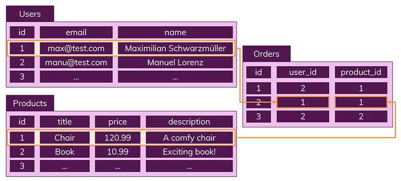

# SQL과 NoSQL의 차이

웹 앱을 개발할 때, 어떤 데이터베이스를 선택할지 고민하게 됨  
MySQL 같은 SQL을 쓸지, MongoDB 같은 NoSQL을 쓸지

단순히 프레임워크(Spring, Node.js 등)에 따라 정할 게 아니라  
**프로젝트 특성에 맞는 DB 선택이 중요**

## SQL (관계형 DB)

- 스키마 기반
- 데이터는 명확한 테이블 구조에 저장됨
- 테이블 간 관계를 통해 중복 없이 관리

### 특징

- 스키마에 맞지 않는 레코드는 추가 불가
- 정해진 구조를 엄격하게 따라야 함
- 조인을 통해 데이터 연결

## NoSQL (비관계형 DB)

- 스키마 없음
- 관계 없음
- 문서(document) 단위로 저장 (JSON 유사)

### 특징

- 구조가 다른 데이터도 같은 컬렉션에 저장 가능
- 조인 없음 → 필요한 모든 데이터를 한 문서에 포함
- 데이터 중복 가능성 존재

## 조인 대신 어떻게?

- 데이터 복제 및 컬렉션 분리로 처리
- 변경이 자주 없는 데이터에 적합

## 확장성

- SQL: 수직적 확장 (서버 성능 업그레이드)
- NoSQL: 수평적 확장 (서버 추가 + 분산처리)

## 뭐가 더 좋을까?

정답은 없음. 사용 목적에 따라 선택해야 함

### SQL 장점

- 명확한 스키마, 무결성 보장
- 중복 없는 데이터 관리

### SQL 단점

- 유연성 부족 (스키마 미리 설계해야 함)
- 복잡한 JOIN 쿼리
- 수직 확장만 지원

### NoSQL 장점

- 스키마 없이 유연한 구조
- 데이터 읽기 속도 빠름
- 수직/수평 확장 모두 가능

### NoSQL 단점

- 중복 데이터 관리 필요
- 수정 시 여러 컬렉션에 반영해야 함

## SQL을 선택해야 할 때

- 자주 변경되는 관계형 데이터
- 데이터 무결성이 중요할 때

## NoSQL을 선택해야 할 때

- 데이터 구조가 유동적이거나 계속 확장될 때
- 읽기 위주 트래픽이 많고 쓰기가 적을 때
- 수평 확장이 필요한 대용량 처리

## 결론

정답은 없음  
SQL과 NoSQL의 단점을 보완하는 설계가 가능함  
상황에 맞는 선택이 중요
