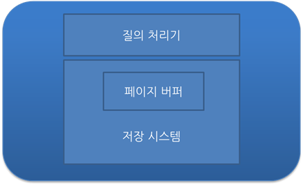

# DB 트랜잭션 (Transaction)

## 트랜잭션이란?

- 데이터베이스의 상태를 변화시키기 위해 수행하는 **작업 단위**
- 상태 변화: SQL 질의어 (SELECT, INSERT, DELETE, UPDATE 등)를 통해 DB에 접근
- 작업 단위: 여러 SQL 명령문을 하나의 단위로 묶음

### 예시

사용자 A가 B에게 1만 원 송금할 때

1. A의 계좌에서 1만 원 차감 → `UPDATE`
2. B의 계좌에 1만 원 추가 → `UPDATE`

→ 위 두 쿼리가 **모두 성공해야만** 하나의 트랜잭션이 성공 (`COMMIT`)  
→ 하나라도 실패 시 전체 작업 취소 (`ROLLBACK`)

## 트랜잭션의 4가지 특성 (ACID)

### 1. 원자성 (Atomicity)

- 트랜잭션은 모두 반영되거나 전혀 반영되지 않아야 함

### 2. 일관성 (Consistency)

- 트랜잭션 처리 결과는 항상 DB의 일관성을 유지해야 함

### 3. 독립성 (Isolation)

- 동시에 실행되는 트랜잭션은 서로 간섭해서는 안 됨

### 4. 지속성 (Durability)

- 트랜잭션이 완료되면 결과는 영구적으로 저장됨

## COMMIT

- 트랜잭션이 정상적으로 끝나고 DB가 일관된 상태임을 보장

## ROLLBACK

- 트랜잭션 도중 오류 발생 시 이전 상태로 되돌리는 연산

---

## 트랜잭션 관리를 위한 DBMS 전략

### DBMS 구성

- `Query Processor`: 질의 처리
- `Storage System`: 데이터 저장
- 디스크에 고정 길이의 페이지 단위로 입출력

### Page Buffer Manager

- 메인 메모리에 유지되는 페이지 관리
- Buffer 교체 알고리즘과 연계되어 트랜잭션 복구에 영향

---

## UNDO (롤백 복구)

- 정상 종료되지 않은 트랜잭션이 변경한 내용을 **원상 복구**

### Buffer 정책

- **steal**: 수정된 페이지를 언제든 디스크에 기록 → undo 필요
- **¬steal**: 수정된 페이지는 트랜잭션 종료 시까지 메모리에 유지 → undo 불필요

## REDO (재반영 복구)

- **커밋된 트랜잭션**의 내용을 디스크에 다시 반영

### Buffer 정책

- **FORCE**: 커밋 시점에 디스크 반영 → redo 불필요
- **¬FORCE**: 커밋 시 반영 안 함 → redo 필요 (대부분의 DBMS가 채택)

---
