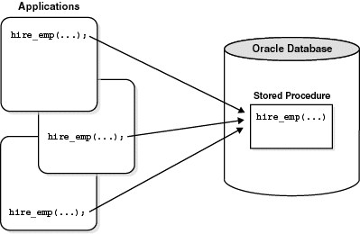

# 저장 프로시저 (Stored Procedure)

일련의 쿼리를 마치 **하나의 함수처럼 실행**하기 위한 쿼리 집합

복잡한 로직의 쿼리를 여러 번 재사용할 때 유용  
입력값만 바꿔서 반복 실행 가능


## 프로시저 생성 및 호출 예시

### 기본 문법

```sql
CREATE OR REPLACE PROCEDURE 프로시저명(변수명1 IN 데이터타입, 변수명2 OUT 데이터타입)
IS
  -- 내부 변수 선언 가능
BEGIN
  -- 기능 구현
END;
```

### 호출

```sql
EXEC 프로시저명;
```

### 예시 1 (IN 파라미터)

```sql
CREATE OR REPLACE PROCEDURE test(name IN VARCHAR2)
IS
  msg VARCHAR2(5) := '내 이름은';
BEGIN
  dbms_output.put_line(msg || ' ' || name);
END;

EXEC test('규글');
-- 출력: 내 이름은 규글
```

### 예시 2 (OUT 파라미터)

```sql
CREATE OR REPLACE PROCEDURE test(name OUT VARCHAR2)
IS
BEGIN
  name := 'Gyoogle';
END;

DECLARE
  out_name VARCHAR2(100);
BEGIN
  test(out_name);
  dbms_output.put_line('내 이름은 ' || out_name);
END;
-- 출력: 내 이름은 Gyoogle
```

---

## 장점

### ✅ 최적화 & 캐시

- 최초 실행 시 최적화 상태로 컴파일되고, 이후 캐시에 저장됨
- 반복 실행 시 성능 향상

### ✅ 유지 보수

- 프로시저 내부만 수정하면 되므로 유지보수가 쉬움

### ✅ 트래픽 감소

- 클라이언트는 프로시저명과 매개변수만 전달 → 네트워크 트래픽 감소

### ✅ 보안

- 프로시저 내부에서 테이블 접근 제한 가능

---

## 단점

### ❌ 호환성

- SQL/PSM 표준과 호환성이 낮아 코드 재사용성 떨어짐

### ❌ 성능

- C, Java와 같은 언어보다 연산 성능이 느림

### ❌ 디버깅

- 에러 발생 시 원인 파악과 디버깅이 어려움

---
