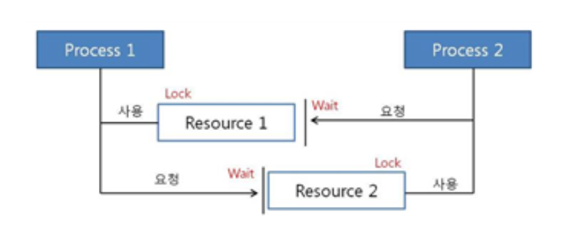

# 데드락

두개 이상의 프로세스나 스레드가 서로를 기다리면서 다음 작업을 무한히 가디리는 현상을 말한다

## 일어나는 경우

멀티 프로그래밍 환경에서 한정된 자원을 얻기 위해 서로 경쟁하는 상황 발생
한 프로세스가 자원을 요청했을 때, 동시에 그 자원을 사용할 수 없는 상황이 발생할 수 있음. 이때 프로세스는 대기 상태로 들어감
대기 상태로 들어간 프로세스들이 실행 상태로 변경될 수 없을 때 '교착 상태' 발생

## 발생 조건(하나라도 성립하지 않으면 데드락이 아니다)

1. 상호 배제

   > 자원은 한번에 한 프로세스만 사용할 수 있음

2. 점유 대기

   > 최소한 하나의 자원을 점유하고 있으면서 다른 프로세스에 할당되어 사용하고 있는 자원을 추가로 점유하기 위해 대기하는 프로세스가 존재해야함

3. 비선점
   > 다른 프로세스에 할당된 자원은 사용이 끝날 때까지 강제로 뺴앗을 수 없음

4.순환대기

> 프로세스의 집합에서 순환 형태로 자원을 대기하고 있어야함

## 데드락 처리

## 교착 상태 발생 전

1. 예방
   교착 상태 발생 조건중 하나를 제거하면서 해결한다(자원의 낭비가 극심하다)

- 상호배제 부정 : 여러 프로세스가 공유 자원 사용
- 점유대기 부정 : 프로세스 실행전 모든 자원을 할당
- 비선점 부정 : 자원 점유 중인 프로세스가 다른 자원을 요구할 때 가진 자원 반납
- 순환대기 부정 : 자원에 고유번호 할당 후 순서대로 자원 요구

  2.회피
  교착 상태 발생시 피해나가는 방법
  _은행원 알고리즘_

  - 은행에서 모든 고객의 요구가 충족되도록 현금을 할당하는데서 유래함
  - 프로세스가 자원을 요구할 때, 시스템은 자원을 할당한 후에도 안정 상태로 남아있게 되는지 사전에 검사하여 교착 상태 회피
  - 안정 상태면 자원 할당, 아니면 다른 프로세스들이 자원 해지까지 대기
    > 은행원이 고객에게 돈을 빌려줄 때, 다른 모든 고객도 최대한도까지 돈을 인출해도 파산하지 않을지를 계산하고 나서만 빌려줌
    > 이와 비슷하게 OS도, 현재 자원 요청을 허용했을 때 데드락 없이 모든 프로세스가 종료 가능한지 계산

## 교착 상태 발생 후

3. 탐지
   자원 할당 그래프를 통해 교착 상태를 탐지함
   자원 요청시, 탐지 알고리즘을 실행시켜 그에 대한 오버헤드 발생함
4. 회복
   교착 상태 일으킨 프로세스를 종료하거나, 할당된 자원을 해제시켜 회복시키는 방법

- 프로세스 종료 방법
  - 교착 상태의 프로세스 모두 중지
  - 교착 상태가 제거될 때까지 하나씩 프로세스 중지
- 자원 선점 방법
  - 교착 상태의 프로세스가 점유하고 있는 자원을 선점해 다른 프로세스에게 할당
  - 우선 순위가 낮은 프로세스나 수행 횟수 적은 프로세스 위주로 프로세스 자원 선점

## 식사하는 철학자

1. n-1명의 철학자만 테이블에 앉힌다
   항상 최소 한 명은 두 젓가락을 모두 집을 수 있어 데드락 회피

2. 양쪽 젓가락 모두 얻을 수 있을 때만 집는다
   젓가락을 하나씩 집는 게 아니라, 둘 다 가능할 때만 집도록 설정

원자적(atomic)으로 두 개를 동시에 시도하여 불완전한 점유 방지

3. 일부 철학자만 오른쪽부터 먼저 집게 한다
   한 방향(왼쪽 → 오른쪽)으로만 젓가락을 집으면 순환 대기가 생기는데,
   일부는 반대로 집도록 설계하면 원형 대기 깨짐 → 순환 조건 제거
